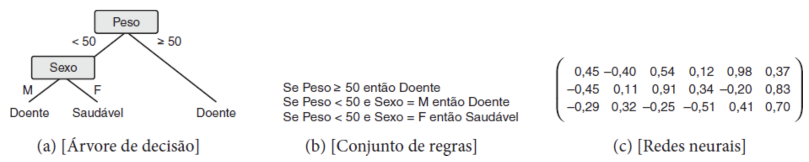

# # 2.1 Capítulo 1 (p. 1/7)

## 1. Introdução

Nos primórdios da computação, a maioria dos sistemas era construída por meio da implementação passo a passo das regras[^1]. Foi somente na década de 1970 que o uso da Inteligência Artificial começou a ser difundido de modo que esses sistemas passaram a ser utilizados em problemas do mundo real.

Esses primeiros sistemas, chamados de **Sistemas Especialistas ou Baseados em Conhecimento**, dependiam de especialistas humanos para adquirir o conhecimento, que era então codificado na forma de um *software* contendo regras lógicas. A dedução do processo de tomada de decisão por esses especialistas era um primeiro obstáculo. Além disso, havia limitações decorrentes da **subjetividade** que é inerente a isso e da **necessidade de cooperação do especialista.**

>"A crescente complexidade dos problemas a serem computacionalmente tratados, e da velocidade e volume de dados gerados por diferentes setores, motivou o desenvolvimento de ferramentas computacionais mais sofisticadas e autônomas, mais independentes da intervenção humana, para a aquisição de conhecimento. A maioria dessas ferramentas é baseada em Aprendizado de Máquina (AM), uma subárea da IA que faz parte de várias das tecnologias atualmente utilizadas." (FACELI et al., 2023, p. 1)

Nesse sentido, contribuíram para o aperfeiçoamento da IA em geral fatores como o aumento da **disponibilidade de infraestrutura de coleta, armazenamento, processamento e distribuição de grandes volumes de dados**, bem como **avanços científicos e tecnológicos** em outras variadas áreas, que além de estimular diretamente os estudos em IA, contribuíram indiretamente porque criaram a demanda por profissionais qualificados na área. Por conseguinte, houve também a ampliação do espectro de possibilidades de uso e, consequentemente, de usuários de sistemas de IA, dentre os quais órgãos públicos e sujeitos da iniciativa privada (pessoas físicas e jurídicas).

Dentre as principais aplicações do mundo real, destacam-se a organização de fotografias, filtros anti-spam, geradores de legendas em vídeos, melhorias em sistemas de recomendação, tradução entre idiomas e detecção de fraudes bancárias, reconhecimento facial e de objetos, auxílio em diagnósticos médicos, otimização do desempenho de personagens em jogos de computador e em jogos como gamão, go e xadrez, uso em contextos de robótica, desenvolvimento de carros autônomos e pesquisas científicas, dentre outros.

>"Aplicações baseadas em AM utilizam heurísticas que buscam por modelos capazes de representar o conhecimento presente em um conjunto de dados. Em geral, os conjuntos de dados são estruturados em formato tabular, uma matriz atributo-valor, em que cada linha representa um objeto (instância ou exemplo) e cada coluna representa um atributo (característica ou variável). Os atributos podem ser divididos em atributos preditivos, cujos valores descrevem características dos objetos, que formam um vetor de entrada, e atributo alvo, cujo valor rotula o objeto, com uma classe ou um valor numérico. Essas denominações têm por origem o frequente uso dos valores dos atributos preditivos de um objeto para predizer o valor de seu atributo alvo. Nem todos os conjuntos de dados possuem atributo alvo. Quando possuem, são chamados de conjuntos de dados rotulados." (FACELI et al., 2023, p. 2/3)

### 1.1 Tarefas de Aprendizado

Na hierarquia clássica, as tarefas de aprendizado de máquina podem ser divididas entre **preditivas**, que visam **inferir o atributo alvo** de uma nova entrada a partir da exposição prévia aos dados **rotulados** durante o treinamento do modelo -- aprendizagem **supervisionada** --, e **descritivas**, que buscam **extrair padrões** dos atributos preditivos -- aprendizagem **não supervisionada**. Por conseguinte, uma vez que pertencem a este paradigma, **as tarefas de aprendizado descritivas não possuem atributos alvo.**

Noutras palavras, tarefas preditivas analisarão os atributos preditivos, comparando-os com os atributos alvo (rótulos), ao passo que tarefas descritivas cotejarão os atributos preditivos entre si, buscando por padrões e correlações.

Ambas as tarefas podem ser categorizadas sob o conceito de **aprendizado indutivo**, que é a capacidade de generalizar a partir de exemplos específicos, isto é, do conjunto de dados de treinamento. Em se tratando de tarefas **preditivas**, observada a divisão clássica, os algoritmos em espécie poderão implementar tarefas de **classificação**, nas quais o atributo alvo (rótulo) é **discreto** (enumerável ou finito), ou de **regressão**, em que o atributo alvo (rótulo) é **contínuo** (não enumerável ou infinito). Já as **descritivas** distinguem-se entre **agrupamento**, que busca por similaridades, **associação**, que busca por padrões frequentes, e **sumarização**, que resulta em uma breve descrição do conjunto de dados.

>"Deve ser observado que, apesar dessa divisão de modelos em preditivos e descritivos, um modelo preditivo pode gerar uma descrição de um conjunto de dados, e um modelo descritivo pode prover previsões após ser validado." (FACELI et al., 2023, p. 4)

Existe ainda uma estrutura hierárquica estendida, que é proposta por alguns teóricos que defendem a impossibilidade de separar todas as tarefas de AM dentre as categorias acima. Nesse sentido, o aprendizado **semissupervisionado** (Zhu; Goldberg, 2009 apud Faceli et al., 2023), que pode consistir em tarefas de agrupamento ou de classificação ou regressão, utiliza-se de dados não rotulados que sabidamente tenham algumas restrições e que necessariamente "[...] devem estar no mesmo grupo ou em grupos diferentes" (FACELI et al., 2023, p. 4) ou de dados parcialmente rotulados, respectivamente. Similarmente, o aprendizado **ativo** (Settles, 2012 apud Faceli et al., 2023), que também se utiliza de dados rotulados e não rotulados, seleciona ativamente dados que tenham atributos vazios que possam ser inferidos a partir dos exemplos rotulados ou mediante o auxílio de um agente externo -- um "oráculo" (Faceli et al., 2023). Finalmente, o aprendizado **por reforço** (Sutton; Barto, 1998 apud Faceli et al., 2023) opera por meio de *feedback*, ou seja, reforços positivos (recompensas) ou negativos (punições) a depender da respectiva avaliação do resultado.

### 1.2 Aprendizado de Máquina e Indução de Modelos

É comum que algoritmos de aprendizagem de máquina implementem a lógica **indutiva**, técnica que consiste inferência de uma conclusão a partir premissas reconhecidamente verdadeiras, ou seja, "[...] permite extrair conclusões genéricas a partir de um conjunto particular de exemplos" (FACELI et al., 2023, p. 4)[^2]. Isso ocorre porque o modelo deve ser capaz manipular dados ditos **imperfeitos**, isto é, que apresentem ruídos, interferências, incompletudes, ambiguidades, inconsistências, ausências e redundâncias. Conquanto não possam ser eliminados, esses problemas devem ser minimizados de modo a reduzir sua influência na etapa de indução.

Em outras palavras, a regra que foi aprendida durante a fase de treinamento "[...] também deve ser válida para outros objetos do mesmo domínio ou problema, que não fazem parte do conjunto de treinamento" (FACELI et al., 2023, p. 5), propriedade que é denominada **generalização**. A baixa capacidade de generalização é um defeito decorrente do superajustamento aos dados de treino (***overfitting***) e "[...] significa que o modelo memorizou ou se especializou nos dados de treinamento." (FACELI et al., 2023, p. 5). Por outro lado, a baixa capacidade de predição (subajustamento ou ***underfitting***) "[...] geralmente ocorre quando os dados de treinamento disponíveis são pouco representativos ou quando o modelo usado é muito simples e não captura os padrões existentes nos dados (Monard e Baranauskas, 2003)" (FACELI et al., 2023, p. 5).

### 1.3 Viés Indutivo

O viés indutivo diz respeito ao modo como o algoritmo correlacionará os atributos preditivos com o atributo alvo, o que "[...] é necessário para restringir os modelos a serem avaliados no espaço de busca." (FACELI et al., 2023, p. 6). Há os vieses de **representação** e de **busca**, os quais, respectivamente, impõem restrições ao espaço de possíveis modelos decorrentes da preferência por determinada **forma ou linguagem próprias** ou por uma **estratégia de busca**.

Nos dois casos, restringe-se como o alvo é representado e, portanto, quais modelos poderão ser inferidos. "Embora, à primeira vista, o viés pareça uma limitação dos algoritmos de AM, segundo (Mitchell, 1997), sem viés um algoritmo de AM não consegue generalizar o conhecimento adquirido durante o processo de treinamento." (FACELI et al., 2023, p. 6)

Para exemplificar, a seguinte imagem elucida como diferentes implementações poderiam representar de formas diferentes -- como árvore de decisão, regras de decisão e matriz de pesos sinápticos -- a modelagem do mesmo conhecimento (FACELI et al., 2023, p. 5):

Figura 14 - Vieses de representação

## Principais tópicos

- Os Sistemas Especialistas ou Sistemas Baseados em Conhecimento foram os primeiros sistemas de IA utilizados para resolver problemas do mundo real.
  - Dependiam de um especialista externo para adquirir conhecimento
  - Obstáculos/Limitadores:
    - Conhecer o processo de tomada de decisão
    - Subjetivismo do tomador da decisão
    - Cooperação do especialista
- Motivadores do crescimento da IA:
  - Aumento da complexidade dos problemas
  - Aumento da capacidade computacional
  - Grandes volumes de dados
  - Avanços científicos e tecnológicos em outras áreas
- **Conjuntos de dados**
  - Formato tabular
    - Matriz atributo-valor, cujas linhas representam uma instância ou exemplo do objeto e as colunas os respectivos atributos, características ou variáveis
      - **Atributos**
        - **Preditivos** (características)
        - **Alvo** (rótulos)
      - Apenas os conjuntos rotulados possuem atributos alvo
- **Tarefas de Aprendizado**
  - **Aprendizado Indutivo**
    - Generalização a partir de exemplos
    - **Preditivas**
      - Aprendizagem supervisionada
      - Dados rotulados
      - Inferência do atributo alvo
      - Espécies
        - **Classificação** (rótulo discreto)
        - **Regressão** (rótulo contínuo)
    - **Descritivas**
      - Aprendizagem não supervisionada
      - Extração de padrões
      - Não há atributo alvo
      - Espécies
        - **Agrupamento**
        - **Associação**
        - **Sumarização**
    - Hierarquia estendida
      - Aprendizado Semissupervisionado
      - Aprendizado Ativo
      - Aprendizado Por reforço
- **Aprendizado de máquina e indução de modelos**
  - **Generalização**
    - *Overfitting*: baixa capacidade de generalização
    - *Underfitting*: baixa capacidade preditiva
- **Viés indutivo**
  - Restringir o espaço de possíveis modelos
  - De representação e de busca

## Notas

[^1]: Paradigma procedural de programação, em contraposição a outros como o funcional e, mais amplamente utilizado e moderno, o orientado a objetos.
[^2]: No tópico 1.5 (exercícios), os autores esclarecem que as principais formas de inferência são a indução, a dedução e a abdução.
