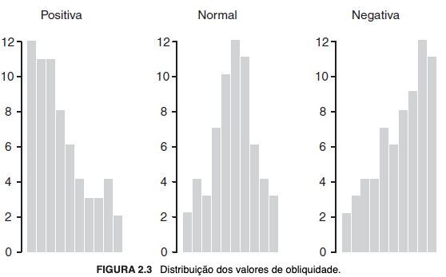
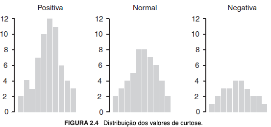

# # 2.2 Capítulo 2 (p. 9/27)

## 1. Parte 1 | Preparação de dados (capítulos 2 e 3)

### 1.1 Introdução aos dados

Os dados são o substrato dos algoritmos de aprendizado de máquina. No entanto, nem sempre é possível utilizá-los diretamente, em sua forma bruta, pois é comum que apresentem problemas como inconsistência, redundância, desbalanceamento, ruídos e incompletudes, que podem ser causados por falhas na integração de duas ou mais fontes de dados, pela grande quantidade de objetos e/ou atributos, pela falta de uniformidade em sua distribuição, pela ausência de valores, pela incompatibilidade do formato original dos dados ou por erros que tenham ocorrido durante alguma das fases do ciclo de vida dos dados (geração, captação/coleta, armazenamento) ou durante a entrada/alimentação dos dados no algoritmo. Nesses casos, **técnicas de pré-processamento** podem ser utilizadas para "[...] corrigir problemas nos dados e para tornar os conjuntos de dados mais adequados para o uso de algoritmos de AM." (FACELI et al., 2023, p. 10). Além disso, pode-se fazer uso da caracterização e da exploração inicial dos dados, por meio de estatísticas descritivas ou técnicas de visualização básicas.

Faceli et al. (2023) elenca as principais técnicas de pré-processamento de dados, mas ressalta que entre elas não há ordem hierárquica ou preferencial, de modo que a opção por uma em detrimento de outra é casuística, e que é possível a repetição desta etapa ou a utilização de mais de uma técnica. "O processo inteiro de uso de AM, que engloba pré-processamento, modelagem e pós-processamento, tem sido chamado de AM de ponta a ponta." (FACELI et al., 2023, p. 11).

Dito isso, as principais tarefas de pré-processamento são **integração de dados, eliminação manual de atributos, amostragem de dados, balanceamento de dados, limpeza de dados, redução de dimensionalidade e transformação de dados**, e fazem parte do que se denomina Mineração de Dados, "[...] que busca extrair conhecimento novo, útil e relevante de um conjunto de dados. [...] enquanto MD [Mineração de Dados] foca no processo, CD [Ciência de Dados] foca nos dados em si [particularmente] no impacto e relevância dos dados, e na manipulação de dados de diferentes tipos." (FACELI et al., 2023, p. 11).

## 2. Análise de dados

"A análise das características presentes em um conjunto de dados permite a descoberta de padrões e tendências que podem fornecer informações valiosas para compreender o processo que gerou os dados." (FACELI et al., 2023, p. 12). Portanto, essa etapa deve preceder à modelagem do sistema, pois fundamental para "[...] uma melhor compreensão da distribuição dos dados e pode dar suporte à escolha de formas para abordar o problema." (FACELI et al., 2023, p. 26).

A análise de dados contempla a **caracterização de dados**, que se debruça sobre o que e de que forma é representado, para que se delimite como interagir com esses dados, e a **exploração de dados**, cujo objetivo é extrair informações úteis, à luz do problema a ser resolvido, para o que podem ser utilizadas medidas estatísticas e técnicas de visualização.

### 2.1 Caracterização de dados [^1]

A caracterização de dados diz respeito à etapa de analisar, compreender e descrever o conjunto de dados, o que passa pela identificação de suas características principais, as quais podem ser obtidas por meio de fórmulas estatísticas ou técnicas de visualização.

>"Formalmente, um conjunto de dados podem ser representados por uma matriz de objetos $X_{nxd}$, em que $n$ é o número de objetos e $d$ é o número de atributos de entrada de cada objeto. O valor de $d$ define a dimensionalidade dos objetos ou do espaço de objetos (também chamado de espaço de entradas ou espaço de atributos). Cada elemento dessa matriz, ${x_i^j}$ ou $x_{ij}$, contém o valor da $j$-ésima característica para o $i$-ésimo objeto. Os $d$ atributos também podem ser vistos como um conjunto de eixos ortogonais e os objetos, como pontos no espaço de objetos de dimensão $d$." (FACELI et al., 2023, p. 12).

#### 2.1.1 Tipo

Determina se um atributo representa quantidades, caso em que será referido por **quantitativo ou numérico**, ou qualidades, caso em que será denominado **qualitativo, simbólico ou categórico** -- neste caso, pois permitem associar o objeto a que se referem a uma categoria ou classe específica.

Os **atributos quantitativos classificam-se em contínuos e discretos**. Um atributo **contínuo** possui um número infinito de valores possíveis, que são comumente representados por números reais, e em geral constituem o resultado de medições, caso em que haverá uma unidade de medida associada ao valor numérico. Já um atributo **discreto** possui uma quantidade finita ou infinita de valores possíveis, mas contáveis, e em geral representam contagens. Atributos quantitativos podem ter seus valores ordenados e utilizados em operações aritméticas. De modo geral, os atributos quantitativos podem ser representados por valores binários, inteiros ou reais.

Os **atributos qualitativos**, geralmente, consistem em uma quantidade finita de símbolos ou nomes, e, ainda que admitida a representação numérica, não faz sentido submeter seus valores a operações aritméticas. Não obstante, podem ser ordenados.

#### 2.1.2 Escala

"A escala define as operações que podem ser realizadas sobre os valores do atributo" (FACELI et al., 2023, p. 14) e, quanto a ela, o atributo pode ser em **nominal, ordinal, intervalar ou racional**.

Atributos de escala **nominal** -- qualitativos -- não podem ser ordenados entre si, sujeitam-se a operações lógicas de igualdade e desigualdade, somente, e intrinsecamente têm a menor quantidade de informação. Um Atributo **ordinal** -- qualitativo -- permite que seja estabelecida ordem entre seus valores e, além da igualdade e desigualdade, podem ser submetidos aos operadores lógicos maior que, menor que, maior ou igual a e menor ou igual a. Atributos **intervalares** -- quantitativos -- registram variações num intervalo e seus valores exprimem, concomitantemente, os significados de ordem e magnitude (intensidade). Possuem um ponto zero (origem da escala) arbitrariamente definido, que não necessariamente corresponderá ao valor matemático atribuído ao numeral zero. Atributos **racionais** -- quantitativos -- têm em si o maior valor semântico possível, pois os valores numéricos estão associados à unidade de medida correspondente. "Os números têm um significado absoluto, ou seja, existe um zero absoluto junto com uma unidade de medida, de forma que a razão tenha significado." (FACELI et al., 2023, p. 15).

### 2.2 Exploração de dados

Como parte do processo de análise de dados, o objetivo derradeiro da exploração de dados é a extração de informações úteis do conjunto de dados. Funciona como norteador da escolha da melhor abordagem ao problema, no que estão inseridas as técnicas de pré-processamento e de aprendizagem de máquina. A estatística descritiva é uma das ferramentas que podem ser utilizadas para isso, a qual "[...] resume de forma quantitativa as principais características de um conjunto de dados [...] gerados por um processo estatístico. Como o processo pode ser caracterizado por vários parâmetros as medidas podem ser vistas como estimativas dos parâmetros estatísticos da distribuição que gerou os dados." (FACELI et al., 2023, p. 16).

Dentre as medições possíveis, pode-se obter informações sobre a **frequência** de um determinado valor -- numérico ou simbólico -- para o atributo naquele dado conjunto, a **localização ou a tendência central** dos dados -- moda, geralmente utilizada para os simbólicos, média, mediana, quartis e percentis, para os numéricos --, a **dispersão ou espalhamento** -- intervalo, variância e desvio padrão -- e sobre a **distribuição ou formato** -- obliquidade e curtose.

"Apesar de a maioria dos conjuntos de dados utilizados em AM apresentar mais de um atributo, análises realizadas em cada atributo podem oferecer informações valiosas sobre os dados." (FACELI et al., 2023, p. 16). Por esse motivo, à exceção da frequência, as demais precitadas medidas estatísticas devem ser calculadas de maneira diversa consoante os dados de entrada possuam um único (univariados) ou mais de um atributo (multivariados).

#### 2.2.1 Medidas [^2]

##### 2.2.1.1 Frequência

Proporcionalmente, é a quantidade de vezes que determinado valor, numérico ou simbólico, é encontrado no conjunto de dados.

##### 2.2.1.2 Localização ou tendência central

São utilizadas para explicitar pontos de referência. Normalmente, utiliza-se a **moda** para atributos qualitativos (simbólicos) e os demais -- **média, mediana, quartis e percentis** -- para atributos quantitativos (numéricos).

A **moda** é o valor que apresenta a maior frequência no conjunto de dados. A **média** é a soma dos valores dividida pela quantidade de elementos. Se simetricamente distribuídos, ela representa fielmente o valor médio do conjunto, isso porque é fortemente distorcida por *outliers*, que são valores extremos ou discrepantes. Há variações, como a média truncada, a fim de mitigar esse problema. A **mediana** indica o valor central, isto é, que divide o conjunto em duas partes iguais. Ela é menos suscetível de distorções causadas por *outliers*. Para que seja calculada, os dados devem estar ordenados, mantendo-se os repetidos, se houver. Feito isso, se a quantidade de elementos do conjunto for um número ímpar, ela corresponderá ao exato valor do meio; se par, à média dos dois valores centrais. Os **quartis** dividem o conjunto em quartos, sendo que o segundo corresponde à mediana, enquanto os **percentis** o dividem em cem partes iguais, sendo o quinquagésimo igual à mediana. Interpreta-se que, no primeiro quartil, há 25% dos dados abaixo dele, no segundo, 50%, e no terceiro, 75%. No caso dos percentis, que no enésimo há $n\%$ dos dados abaixo dele. Para calculá-los, os valores devem estar ordenados.

##### 2.2.1.3 Dispersão ou espalhamento

Determinam "[...] se os valores estão amplamente espalhados ou relativamente concentrados em torno de um [outro] valor, por exemplo, a média." (FACELI et al., 2023, p. 18). Dentre elas, o **intervalo** é a diferença entre o maior e o menor valor, de modo que revela o espalhamento máximo (amplitude) do conjunto. A **variância** mede o quanto cada valor está distante da média e, por esse motivo, tal como esta, é bastante sensível à presença de *outliers*. Para mitigar esse problema, utiliza-se o **desvio padrão**, que é a raiz quadrada da variância.

##### 2.2.1.4 Distribuição ou formato

Revelam a forma como os dados estão distribuídos, sendo que a **obliquidade** indica a simetria e a **curtose** indica o achatamento dessa distribuição em relação à normal. Diz-se que a distribuição aproxima-se da simetria quando é normal e, nesse caso, a obliquidade é igual a zero; ela será positiva ou negativa, respectivamente, se assimétrica (com maior concentração da distribuição) à esquerda ou à direita, considerando-se a utilização de um histograma. Por sua vez, a curtose será igual a zero se o achatamento for idêntico ao de uma distribuição normal, positiva se mais alta e negativa se mais baixa, também considerado o histograma.

Abaixo, histogramas ilustrativos de distribuições conforme a obliquidade e a curtose:

Figura 15 - Distribuição dos valores de obliquidade. (FACELI et al., 2023, p. 20).

Figura 16 - Distribuição dos valores de curtose. (FACELI et al., 2023, p. 21).

#### 2.2.2 Dados univariados

São aqueles que representam objetos que possuem um único atributo e, portanto, dado um conjunto de dados qualquer, cada elemento corresponde simultaneamente ao atributo e ao próprio objeto. São utilizadas medidas de frequência, localidade, espalhamento e distribuição. As técnicas de visualização mais comuns são histogramas, boxplots e gráficos de pizza.

#### 2.2.3 Dados multivariados

Possuem mais de um atributo, o que possibilita analisar a existência de relação entre dois ou mais deles. As medidas de localidade e espalhamento são calculadas individualmente para cada atributo. Ademais, pode-se medir a **covariância** e a **correlação**, que indicam se e como os atributos observados variam juntos e estão entre si relacionados. Esta possui vantagem sobre aquela, pois elimina a influência da ordem de grandeza dos atributos que afeta o cálculo daquela. É a medida mais utilizada para essa finalidade porque "[...] apresenta uma indicação mais clara da força da relação linear entre dois atributos." (FACELI et al., 2023, p. 22). Se a covariância for próxima a $0$, é indicativo de inexistência de relação linear entre os atributos; do contrário, conforme seu valor aumente ou diminua, indica que aumento ou enfraquecimento da relação, respectivamente. A correlação, por sua vez, é medida no intervalo de $-1$ a $1$, que correspondem à máxima correlação negativa ou positiva, respectivamente. As técnicas de visualização mais comuns são scatter plots, bagplots, star plots, diagramas de faces de Chernoff e heatmaps.

## Principais tópicos

- **Preparação de dados**
  - Correção de problemas nos dados brutos
    - Inconsistência, redundância, desbalanceamento, ruído, incompletude
  - **Técnicas de pré-processamento**
    - Integração de dados
    - Eliminação manual de atributos
    - Balanceamento de dados
    - Limpeza de dados
    - Redução de dimensionalidade
    - Transformação de dados
  - **Análise de dados**
    - **Caracterização**
      - **Tipo**
        - Quantitativo ou numérico
          - Contínuo
          - Discreto
        - Qualitativo, simbólico ou categórico
      - **Escala**
        - Nominal
        - Ordinal
        - Intervalar
        - Racional
    - **Exploração**
      - Extração de informações úteis escolha da melhor abordagem
      - **Medidas da Estatística descritiva**
        - **Frequência**
        - **Localidade/localização ou tendência central**
          - Moda
          - Média
          - Mediana
          - Quartis e percentis
        - **Dispersão ou espalhamento**
          - Intervalo
          - Variância
          - Desvio padrão
        - **Distribuição ou formato**
          - Obliquidade
          - Curtose
      - **Técnicas de visualização**
        - Boxplot
        - Histograma
        - Scatter plot
        - Gráfico de pizza
        - Bagplot
        - Star plot
        - Diagrama de faces de Chernoff
        - Heatmap
      - Dados univariados
        - Medidas: frequência, localidade, espalhamento e distribuição
        - Técnicas de visualização: histogramas, boxplots e gráficos de pizza
      - Dados multivariados
        - Medidas: localidade e espalhamento, ambas individualmente para cada atributo, covariância e correlação
        - Técnicas de visualização: scatter plots, bagplots, star plots, diagramas de faces de Chernoff e heatmaps

## Notas

[^1]: No livro, os atributos são definidos em termos de tipo e escala. No entanto, destaca-se que os próprios autores mencionam que "[...] alguns atributos não seguem necessariamente essa classificação, tais como textos e imagens, que podem ser considerados não estruturados." (FACELI et al., 2023, p. 13). Em nota de rodapé, sobre as imagens, é esclarecido que "[...] cada pixel de uma imagem possa ser considerado um atributo quantitativo." (FACELI et al., 2023, p. 13).

[^2]: Esta divisão não está presente no livro, mas acredito que seja útil para fins didáticos. No livro, as medidas de localidade, espalhamento e distribuição são abordadas como subtópico em "dados univariados", ao passo que a de frequência é apenas mencionada superficialmente, em um parágrafo, na subseção principal ("exploração de dados").
