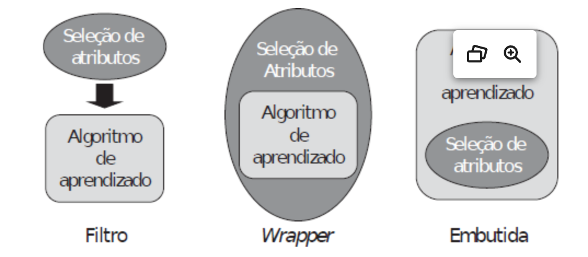

# # 2.3 Capítulo 3 (p. 28/48)

## Parte 1 | Preparação de dados (capítulos 2 e 3)

### 3. Pré-processamento de dados

O pré-processamento de dados engloba o uso de uma ou mais técnicas com o objetivo fundamental de aperfeiçoar a qualidade dos dados para a posterior alimentação dos algoritmos de aprendizagem de máquina. Essa etapa é necessária porque os "conjuntos de dados podem apresentar diferentes características, dimensões ou formatos" (FACELI et al., 2023, p. 28), além de problemas que dificultem, desaconselhem ou mesmo impeçam o uso em sua forma bruta.

De fato, o pré-processamento é importante porque o estado e a qualidade dos dados afeta diretamente o desempenho dos algoritmos de aprendizagem.

De modo geral, podem ser elencas as seguintes vantagens no pré-processamento de dados:

>"[...] facilitar o uso de técnicas de AM, levar à construção de modelos mais fiéis à distribuição real dos dados, reduzindo sua complexidade computacional, tornar mais fáceis e rápidos o ajuste de parâmetros do modelo e seu posterior uso. [...] adicionalmente, facilitar a interpretação dos padrões extraídos pelo modelo. Técnicas de pré-processamento de dados são úteis não apenas porque podem minimizar ou eliminar problemas existentes em um conjunto de dados, mas também porque podem tornar os dados mais adequados para sua utilização por um determinado algoritmo de AM." (FACELI et al., 2023, p. 28).

#### 3.1 Integração de dados

Esta técnica atende, essencialmente, a duas finalidades distintas: combinar diferentes fontes de dados, e consequentemente mais de um conjunto de dados, e assegurar a integridade dos dados, e desse modo a sua confiabilidade, ao impedir que um mesmo atributo de determinado objeto seja representado mais de uma vez, em conjuntos diversos, e/ou que um dado objeto tenha seus atributos fragmentados em diferentes conjuntos.

Nesse sentido, o **problema de identificação de entidade** é enfrentado "[...] por meio da busca por atributos comuns nos conjuntos a serem combinados" (FACELI et al., 2023, p. 29), de sorte que "[...] os objetos dos diferentes conjuntos que possuem o mesmo valor para o atributo [...] são combinados em um único objeto do conjunto integrado. [Esses atributos] deve(m) ter um valor único para cada objeto." (FACELI et al., 2023, p. 29).

Uma das formas de contornar eventuais dificuldades ao se implementar esta técnica é por meio de metadados, que "[...] são dados sobre dados que, ao descrever as suas principais características, podem ser utilizados para evitar erros no processo de integração. [Se isso for feito] O processo de integração origina um depósito ou repositório de dados (*data warehouse*), que funciona como uma base de dados centralizada." (FACELI et al., 2023, p. 29).

#### 3.2 Eliminação manual de atributos

É sabido que objetos com grande quantidade de atributos podem comprometer o desempenho dos algoritmos de aprendizado. Ademais, há que se ponderar sobre a "[...] relevância dos atributos para o problema que está sendo tratado [o que] também é essencial para a qualidade dos resultados" (FACELI et al., 2023, p. 29), pois há situações nas quais somente alguns deles serão realmente úteis, ao passo que os demais podem ser descartados pela irrelevância para certa tarefa.

Por esse motivo, ressalvadas as obviedades, "o conjunto de atributos que formarão o conjunto de dados a ser analisado é geralmente definido de acordo com a experiência de especialistas no domínio dos dados" (FACELI et al., 2023, p. 29) ou por meio de técnicas de seleção de atributos irrelevantes.

#### 3.3 Amostragem de dados

A depender do algoritmo utilizado, a grande quantidade de objetos/instâncias/exemplos em um conjunto de dados pode ser uma condição indesejada. Nesse sentido,

>"associado ao número de objetos em um conjunto de dados, existe um balanço entre eficiência computacional e acurácia (taxa de predições corretas). Quanto mais dados são utilizados, maior tende a ser a acurácia do modelo e menor a eficiência computacional do processo indutivo, pois um número muito grande de objetos pode tornar o tempo de processamento muito longo. [Por esse motivo] Para se obter um bom compromisso entre eficiência e acurácia, geralmente trabalha-se com uma amostra ou subconjunto de dados." (FACELI et al., 2023, p. 30).

Contudo, esse balanço deve ser cuidadosamente ponderado a fim de assegurar a representatividade da amostra, de modo que a partir dela seja possível obter resultados idênticos àqueles que de outra forma já seriam verificados, isto é, "[...] o uso da amostra [deve] leva[r] ao mesmo desempenho obtido com o uso do conjunto completo, porém com um custo computacional muito menor." (FACELI et al., 2023, p. 30). Logo, em linhas gerais, pode-se dizer que a melhor amostragem é aquela que preserva a distribuição estatística original e, ao mesmo tempo, reduza o tamanho da amostra a ponto de gerar economia relevante em termos de recursos computacionais.

Por conseguinte, a amostra extraída deve ser capaz de estimar com razoabilidade a "[...] informação contida na população original, permitindo tirar conclusões de um todo a partir de uma parte." (FACELI et al., 2023, p. 30).

Dentre as formas de extração, menciona-se a amostragem aleatória simples, a amostragem estratificada e a amostragem progressiva[^1].

#### 3.4 [Balanceamento de] Dados desbalanceados

O balanceamento de dados necessariamente pressupõe que o modelo implementará uma tarefa de classificação e que, dentre os objetos dos dados de entrada, a frequência de determinada classe é significativamente maior do que a de outra, tal que faça sentido distingui-los de maneira binária entre classes majoritária e minoritária. Sendo o caso, para que não seja necessário balancear o conjunto original, "[...] a acurácia preditiva [...] deve ser maior que a acurácia obtida atribuindo todo novo objeto à classe majoritária" (FACELI et al., 2023, p. 31), sob pena de que o modelo perca desempenho.

Com efeito, "quando alimentados com dados desbalanceados, esses algoritmos tendem  a favorecer a classificação de novos dados na classe majoritária. Se for possível gerar novos dados pelo mesmo processo que originou o conjunto atual, o conjunto de dados pode ser naturalmente balanceado. Na maioria das aplicações práticas, no entanto, isso não é possível." (FACELI et al., 2023, p. 31).

Dentre as formas mais utilizadas para enfrentar o problema do desbalanceamento de dados estão a (a) **redefinição do tamanho do conjunto de dados**, que pode ser feita pela (a.i) adição de novos objetos à classe minoritária ou (a.ii) pela retirada de exemplos da minoritária. Aquela solução envolve os riscos de (a.i.i) incorporar casos impossíveis ao modelo e/ou (a.i.ii) enviesá-lo a ponto de provocar o superajustamento aos dados de treino e, por conseguinte, o comprometimento da capacidade de generalização (*overfitting*); esta, por sua vez, pode acabar por (a.ii.i) ignorar dados importantes tal que comprometa a capacidade preditiva do modelo, culminando em subajustamento (*underfitting*). Outras abordagens possíveis são a (b) **criação de funções de custo específicas para cada classe**, opção que é obstaculizada pela dificuldade (b.i) no cálculo de tais custos e (b.ii) na implementação dessa lógica nos algoritmos, e a (c) **indução de modelos específicos**, em que cada classe é aprendida separadamente.

#### 3.5 Limpeza de dados

Dizem respeito a formas de atenuar ou eliminar problemas associados a dados ruidosos, incompletos, inconsistentes ou redundantes. "Essas deficiências nos dados podem ser causadas por problemas nos equipamentos que realizam a coleta, a transmissão e o armazenamento dos dados ou problemas no preenchimento ou na entrada dos dados por seres humanos." (FACELI et al., 2023, p. 32). O objetivo é **aumentar a qualidade** dos dados para otimizar o desempenho dos algoritmos de aprendizagem, pois mesmo aqueles que conseguem lidar com certas imperfeições costumam se beneficiar do uso de dados mais limpos.

##### 3.5.1 Dados incompletos

Os valores de alguns atributos de alguns dos objetos estão ausentes. Dentre as possíveis soluções, destacam-se a (a) **eliminação de objetos**, especialmente se o atributo em questão for indicativo da classe, mas desaconselhada se o problema afetar poucos atributos de um mesmo objeto, quando a quantidade de atributos ausentes variar muito entre os objetos ou quando houver muitos objetos com atributos faltantes; a (b) **inserção manual de atributos**, inviável se houver muitos deles; e a (c) **implementação de um método para definição automática**, o que pode ser feito (c.i) pela definição de um valor indicativo de que aquele atributo estava anteriormente vazio, o que pode levar à valoração equivocada da relevância desse atributo para o conjunto de dados, (c.ii) pelo uso de medidas estatísticas de frequência ou tendência central ou (c.iii) pela indução a partir do valor dos demais atributos presentes.

##### 3.5.2 Dados inconsistentes

Ocorre quando os atributos explicitam valores contraditórios ou conflitantes, tanto entre os atributos do conjunto de entrada comparados entre si, quanto entre o conjunto de entrada e o valor do atributo de saída. São bem evidentes quando há violação de relações conhecidas entre os atributos. Podem ser resultado da presença de ruídos no conjunto de dados.

##### 3.5.3 Dados redundantes

Diz-se dos **objetos** que apresentem grande semelhança entre si, assim considerados aqueles cujos atributos têm valores muito próximos ou iguais a outro objeto, bem como de **atributos** com valores idênticos ou que possam ser deduzidos a partir de outro(s), pois "[...] têm a mesma informação preditiva." (FACELI et al., 2023, p. 36). A eliminação da redundância é importante para evitar a supervalorização de determinado aspecto do conjunto e para economizar recursos computacionais. "A redundância de um atributo está relacionada com a sua correlação com um ou mais atributos do conjunto de dados. Dois ou mais atributos estão correlacionados quando apresentam um perfil de variação semelhante para os diferentes objetos. Quanto mais correlacionados os atributos, maior o grau de redundância. Se a correlação ocorrer entre um atributo de entrada e um atributo rótulo, esse atributo de entrada terá uma grande influência na predição do valor do atributo rótulo." (FACELI et al., 2023, p. 36).

##### 3.5.4 Dados com ruídos

"Ruído pode ser definido como uma variância ou erro aleatório no valor gerado ou medido por um atributo (Han e Kamber, 2020)" (FACELI et al., 2023, p. 37) e, nesse sentido, diz-se que há ruído quando o atributo ou objeto em questão pareça dissonante em relação aos demais. "Dados com ruídos são dados que contêm objetos que, aparentemente, não pertencem à distribuição que gerou os dados analisados" (FACELI et al., 2023, p. 37) e sua presença pode conduzir ao *overfitting* (superajuste), se o modelo sobrevalorizar os objetos ruidosos em detrimento dos demais. Por outro lado, a eliminação deve ser feita cautelosamente, para evitar a perda de informação relevante.

"É importante observar que não é possível ter certeza de que um valor é ou não resultado da presença de ruído, mas apenas ter uma indicação ou indício de que um dado valor para um atributo pode ter sido gerado com ruído" (FACELI et al., 2023, p. 37), sendo a presença de valores discrepantes (*outliers*) um bom indicativo.

Dentre as maneiras de atenuar o ruído, destacam-se as técnicas de encestamento e as baseadas em agrupamento, distância e regressão ou classificação dos dados.

#### 3.6 Transformação de dados

As técnicas de transformação visam converter (mapear) os dados de um formato (tipo) para outro, de modo a torná-los adequados ao algoritmo de aprendizagem que será utilizado, que, no mais das vezes, admite ou lida melhor com um tipo específico de dado.

##### 3.6.1 Conversão simbólico-numérico

É importante que a existência ou inexistência de relação de ordem entre os valores dos atributos, conforme o caso, seja preservada. "Ou seja, [se nominais, isto é, sem relação de ordem] a diferença entre quaisquer dois valores numéricos deve ser a mesma. [...] Quando existe uma relação de ordem, [isto é] o atributo é do tipo ordinal, [...] a codificação deve preservar essa relação. [...], [de modo que] a distância entre os valores varia de acordo com a proximidade deles [...]." (FACELI et al., 2023, p. 38/40).

Dito isso, o modo como será feita a conversão dependerá de que o atributo simbólico seja nominal ou ordinal.

Para a representação de um atributo **nominal** que assuma apenas dois valores (categórico), bastará um único dígito binário - 0 ou 1 -; já aqueles que possam assumir mais de dois valores podem ser representados por uma sequência binária contendo tantos bits quantos forem os possíveis valores ou categorias do atributo. Neste caso, uma abordagem possível é a **codificação 1-de-c**, também referida como canônica ou topológica, na qual apenas um dos bits sequenciais terá o valor 1 - e os demais, 0, portanto -, sendo que o valor ou categoria do atributo corresponderá à posição do bit com valor igual a 1. A distância de Hamming, segundo a qual o intervalo "[...] entre duas sequências binárias com mesmo número de elementos é igual ao número de posições em que as sequências apresentam valores diferentes" (FACELI et al., 2023, p. 38), pode ser adotada como critério para diferenciar os valores simbólicos. Alternativamente, podem ser mapeados para um conjunto de pseudoatributos binários, inteiros e/ou reais.

Por outro lado, atributos **ordinais** podem ser representados por um número inteiro ou real que adequadamente corresponda e mantenha a semântica da ordenação original ou convertidos em valores binários.

##### 3.6.2 Conversão numérico-simbólico

Em se tratando de atributo quantitativo **discreto** - binário ou não binário, desde que não tenham relação de ordem -, a conversão pode ser feita mediante a criação de um nome ou categoria associada. No que diz respeito a atributos quantitativos **contínuos**, a conversão pode ser feita pelo emprego de **métodos de discretização**, modo que os valores sejam mapeados para um conjunto de categorias ou intervalos. Esses métodos podem ser classificados em **paramétricos ou não paramétricos** - consoante a divisão em intervalos possa ou não ser arbitrariamente orientada por algum critério, como a quantidade de intervalos e/ou de itens em cada um deles - e em **supervisionados ou não supervisionados** - conforme sejam ou não informados os rótulos das classes dos objetos. A discretização comumente implementa estratégias que envolvem a criação de subconjuntos com larguras ou frequências iguais, estando aquela suscetível a *outliers* e esta, a desbalanceamento, o agrupamento de dados ou a inspeção visual.

##### 3.6.3 Transformação de atributos numéricos

Pode ser necessária, a fim de evitar a predominância de um sobre outro, para lidar com atributos (i) cujos valores sejam muito díspares - isto é, com grande variação entre si -; (ii) que estejam em escalas diferentes ou incompatíveis; e/ou (iii) para facilitar a manipulação.

Há disparidade quando "[...] os limites inferior e superior de valores dos atributos são muito diferentes [...]" (FACELI et al., 2023, p. 41), o que pode ser solucionado por técnicas de **normalização** (a) por amplitude ou (b) por distribuição. No primeiro caso, subdivide-se em (a.i) normalização por reescala e (a.ii) padronização, que, respectivamente, definem para todos os atributos "[...] uma nova escala de valores, limites mínimos e máximo [...]" e "[...] um valor central e um valor de espalhamento comuns [...]" (FACELI et al., 2023, p. 41). No segundo, "[...] a cada valor do atributo a ser normalizado é adicionada ou subtraída uma medida de localização e o valor resultante é em seguida multiplicado ou dividido por uma medida de escala. Com isso, diferentes atributos podem ter limites inferiores e superiores distintos, mas terão os mesmos valores para as medidas de escala e espalhamento." (FACELI et al., 2023, p. 42). É importante destacar que, "geralmente, é preferível padronizar a reescalar, pois a padronização lida melhor com *outliers*." (FACELI et al., 2023, p. 42).

A transformação também pode ser feita por **tradução**, que tão somente visa a facilitação do manuseio, sem prejuízo da carga informacional. "Por exemplo, a conversão de um atributo com data de nascimento para idade, de graus Celsius para Fahrenheit ou de localização dada por um aparelho de GPS para código postal." (FACELI et al., 2023, p. 42).

#### 3.7 Redução de dimensionalidade [^2]

Um conjunto de dados grande não necessariamente é aquele que possui muitos objetos, mas também aquele que cujos objetos tenham muitos atributos. Ambas as situações são capazes de comprometer o desempenho dos algoritmos de AM, ou mesmo inviabilizar o uso de um determinado conjunto de dados, porque o algoritmo é incapaz de lidar com tamanha quantidade. Além das limitações inerentes ao próprio algoritmo, reduzir a dimensionalidade também favorece a efetividade do processo indutivo, a economia de recursos computacionais e melhora a interpretabilidade dos resultados.

As principais técnicas estão concentradas nas abordagens de **agregação**, que cria novos atributos pela aglutinação de dois ou mais originários, e de **seleção de atributos**, que envolve o descarte de atributos desnecessários. Dentre as primeiras, destaca-se a **Análise de Componentes Principais (*Principal Component Analysis* - PCA)**, que "[...] descorrelaciona estatisticamente os exemplos, reduzindo a dimensionalidade do conjunto de dados original pela eliminação de redundâncias" (FACELI et al., 2023, p. 43) e que, tal como todas as implementações dessa abordagem, acarreta a perda dos dados originais. Já as técnicas do segundo grupo "[...] procuram por um subconjunto ótimo de atributos de acordo com um dado critério" (FACELI et al., 2023, p. 43), sendo que a seleção pode ser feita manual ou automaticamente, preferindo-se esta àquela forma para mitigar a interferência de fatores como a grande quantidade de objetos ou de atributos, ou a complexidade das relações entre eles.

No que diz respeito à **seleção de atributos**, esta pode ser **baseada em filtro, baseada em *wrapper* e embutida**.

Na primeira - **abordagem baseada em filtro** -, a filtragem ocorre pela seleção de atributos com base em algum critério arbitrariamente escolhido e é independente do algoritmo de AM. A filtragem consume poucos recursos computacionais, característica que, assim como a independência em relação ao algoritmo, pode ser vantajosa - neste caso, se houver necessidade de reaproveitamento do subconjunto em outro(s) algoritmo(s). Por outro lado, o desempenho do modelo pode restar prejudicado, notadamente porque "[...] como a seleção e a indução são processos separados, o viés de um não interage com o viés de outro, o que pode levar à construção de indutores com desempenho aquém do desejado." (FACELI et al., 2023, p. 43/44).

Já a **abordagem baseada em *wrapper*** faz a seleção é feita por um algoritmo, que criará diversos subconjuntos e escolherá aquele com a melhor relação "[...] entre redução da taxa de erro e [...] do número de atributos [...]" (FACELI et al., 2023, p. 44). Embora haja algoritmos eficientes, o custo computacional poderá ser elevado. Além disso, há que se considerar o enviesamento da seleção, o que, todavia, pode ser benéfico sob o ponto de vista do modelo a ser induzido: "por incorporar o viés do classificador, as técnicas baseadas em *wrapper* em geral conseguem obter um conjunto de atributos que leva a um melhor desempenho posterior do modelo." (FACELI et al., 2023, p. 44).

Finalmente, na **abordagem embutida** a seleção é feita pelo próprio algoritmo de AM. Uma vez que não é necessário repetir o treinamento para cada subconjunto, como na abordagem anterior, é mais eficiente.

Figura 17 - Ilustração das abordagens de seleção de atributos (FACELI et al., 2023, p. 43).

Quanto às **técnicas de seleção**, enquanto as duas primeiras podem implementar tanto técnicas de ordenação quanto de seleção de subconjuntos, com ou sem informações sobre a classe, a última é restrita às de seleção de subconjuntos.

As técnicas de **ordenação**, também chamadas técnicas de ***ranking***, como o próprio nome sugere, ordenam os atributos conforme um dado critério, pelo que simplificadamente acabam por colocar os atributos em ordem de importância. Essa técnica é costumeiramente adotada nos casos em que a seleção deva ser **individual ou univariada**, isso porque considera a relevância de cada atributo para a classificação do objeto. Por esse motivo, não encontra correlação ou redundância entre atributos.

Diferentemente, nas técnicas de **seleção de subconjuntos** a análise é **coletiva**, isto é, a totalidade do subconjunto é mais importante do que o atributo em si, o que permite o encontro de eventuais correlações. "A seleção de um subconjunto de atributos pode ser vista como um problema de busca. Cada ponto no espaço de busca pode ser considerado como um possível subconjunto de atributos." (FACELI et al., 2023, p. 45). Nesse sentido, a qualidade do resultado depende da melhor escolha de aspectos como o ponto de início, o sentido e a estratégia da busca, além de critérios para avaliar os subconjuntos e o ponto de parada.

Por fim, é importante destacar que as técnicas de seleção de subconjuntos são mais custosas do que as de ordenação, tal que inviável para conjuntos de dados com muitos atributos. Não obstante, nesse caso é possível o emprego consecutivo das duas técnicas, de modo que os atributos sejam primeiramente ordenados consoante a sua relevância individual e, em seguida, formados os subconjuntos tão somente com os melhores colocados, a partir desses dados preordenados.

## Principais tópicos

- Pré-processamento de dados
  - Melhorar a qualidade dos dados
- **Técnicas de pré-processamento**
  - **Integração de dados**
    - Combinação de duas ou mais fontes diferentes
    - Assegurar a integridade dos dados
      - Problema de identificação de entidade
  - **Eliminação manual de atributos**
    - Descarte de atributos irrelevantes
  - **Amostragem de dados**
    - Redução do tamanho do conjunto de dados
    - Preservação da representatividade da amostra
    - Dilema eficácia computacional *versus* acurácia
    - Elaborar conclusões sobre o todo a partir de uma parte
  - **Balanceamento de dados desbalanceados**
    - Tarefa de classificação
    - Classes majoritária e minoritária
    - Maior frequência de uma classe
    - Abordagens
      - Redefinição do tamanho do conjunto de dados
      - Funções de custo para cada classe
      - Indução de modelos por classe
  - **Limpeza de dados**
    - Dados ruidosos, incompletos, inconsistentes ou redundantes
    - Aumentar a qualidade dos dados
  - **Transformação de dados**
    - Mapeamento de dados de um formato para outro
    - Conversão simbólico-numérico, numérico-simbólico e transformação de atributos numéricos
  - **Redução de dimensionalidade**
    - Diminuição da quantidade de atributos ou objetos
    - Agregação
    - Seleção de atributos
      - Técnicas de ordenação e seleção de subconjuntos

## Notas

[^1]: Na seção 3.3, os autores distinguem essas abordagens. No entanto, optei por não incluir esses pontos neste momento, uma vez que pretendo estudá-los mais adiante em livros de Estatística.
[^2]: No livro, o tópico é subdividido nas seções 3.7.1 (agregação), 3.7.2 (seleção de atributos), 3.7.3 (técnicas de ordenação) e 3.7.4 (técnicas de seleção de subconjunto).
