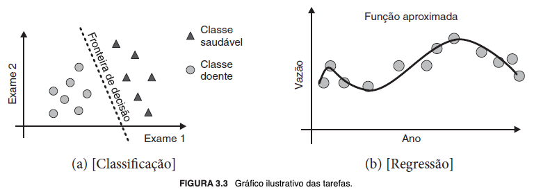

# # 2.3 Capítulo 4 (p. 49/63)

## Parte 2 | Modelos preditivos (capítulos 4 a 10)

### Introdução aos modelos preditivos [^1]

> "Um algoritmo de AM preditivo é uma função que, dado um conjunto de exemplos rotulados, constrói um estimador. O rótulo ou etiqueta toma valores em um domínio conhecido. Se esse domínio for um conjunto de valores nominais, tem-se um problema de classificação, também conhecido como aprendizado de conceitos, e o estimador gerado é um classificador. Se o domínio for um conjunto infinito e ordenado de valores, tem-se um problema de regressão, que induz um regressor. Um classificador (ou regressor), por sua vez, também é uma função, que, dado um exemplo não rotulado, atribui esse exemplo a uma das possíveis classes (ou a um valor real) (Dietterich, 1998). Uma definição formal seria, dado um conjunto de observações de pares $D = \{(x_i, f(x_i)), i = 1, ..., n\}$, em que $f$ representa uma função desconhecida, um algoritmo de AM preditivo aprende uma aproximação $\hat{f}$ da função desconhecida $f$. Essa função aproximada, $\hat{f}$, permite estimar o valor de $f$ para novas observações de $x$." (FACELI et al., 2023, p. 50).

Noutras palavras, consiste em uma **função[^2] que mapeia dois conjuntos de dados**, sendo um de exemplos rotulados (atributos preditivos/entrada/*inputs*/variáveis independentes) e outro contendo os rótulos correspondentes - que compõem o conjunto de dados de treinamento -, **com o objetivo de induzir um modelo preditor: um algoritmo que, por aproximação, aprenda a prever o valor** que deve ser assumido por outro novo exemplo, não visto anteriormente (alvos/saída/*outputs*/variáveis dependentes).

Portanto, implementam regras de aprendizagem inerentes ao paradigma supervisionado para a indução do modelo.

Os casos de uso dos modelos preditivos distinguem-se quanto à natureza do que se propõem a resolver, que no mais das vezes são problemas de **classificação**, em que normalmente se busca categorizar atributos qualitativos de conjuntos com valores finitos (nominais, discretos e não ordenados)[^3], ou **regressão**, que lida com atributos quantitativos e conjuntos com valores reais infinitos (numéricos, contínuos e ordenados). Respectivamente, o objetivo é "[...] encontrar uma fronteira de decisão que separe os exemplos de uma classe dos exemplos da outra" (FACELI et al., 2023, p. 50) e "[...] aprender uma função que relacione [os objetos] [...]" (FACELI et al., 2023, p. 50).

Para exemplificar, vejamos a imagem a seguir:

Figura 18 - Gráfico ilustrativo de tarefas (FACELI et al., 2023, p. 50).

Em suma, os problemas de classificação referem-se à tarefa de atribuir um objeto a uma classe, enquanto os de regressão à de prever um valor numérico associado às variáveis independentes (atributos de entrada) a um objeto e que expresse sua relação com os demais. A grosso modo, "em ambos os casos, o objetivo do aprendizado preditivo é aprender uma função $\hat{f}(x)$ que mapeia as variáveis independentes, os atributos de entrada, na variável objetivo, o atributo alvo." (FACELI et al., 2023, p. 51).

### 4. Métodos baseados em distâncias

A proximidade entre as variáveis é o aspecto mais relevante, pois "a hipótese base é que dados similares tendem a estar concentrados em uma mesma região no espaço de entrada/características. De maneira alternativa, dados que não são similares estarão distantes entre si." (FACELI et al., 2023, p. 53). A proximidade, que decorre da similitude, é constatada visualmente pelo agrupamento dos pontos na representação gráfica dos dados, que revela áreas com maior densidade de observações.

A premissa fundamental é de que "objetos relacionados com o mesmo conceito são semelhantes entre si" (FACELI et al., 2023, p. 54), circunstância que evidencia que, em problemas de classificação, "[...] a distância entre os objetos está relacionada com a definição de suas classes." (FACELI et al., 2023, p. 53). Logo, nesses casos, infere-se que objetos pertencentes à mesma classe estarão concentrados, isto é, próximos uns dos outros. Todavia, esses algoritmos podem ser empregados tanto tarefas de classificação quanto de regressão.

Os principais são os **algoritmos dos vizinhos mais próximos**, bastante úteis a despeito do funcionamento simplificado. Eles "[...] classifica[m] um novo objeto com base nos exemplos do conjunto de treinamento que são próximos a ele[s] [no espaço de entrada/características]" (FACELI et al., 2023, p. 54) e são considerados algoritmos **preguiçosos (*lazy*)** porque, na etapa de treinamento, não aprendem diretamente um modelo, mas armazenam ("memorizam") o conjunto de dados de treino - os próprios objetos - para calcular as distâncias e, daí, realizar as predições. Por esse motivo, conclui-se que podem se tornar computacionalmente caros se utilizados com conjuntos muito grandes de dados.

Em sua versão mais simples - algoritmo do **1-Vizinho Mais Próximo (1-*Nearest Neighbor* - 1-NN)** -, cada objeto constitui um ponto no espaço de entrada/características, tal que possibilite calcular o quanto distam entre si por alguma métrica, que usualmente é a distância euclidiana. Por derivação lógica, tem-se o algoritmo **K-NN (K-*Nearest Neighbors*)**, em que **K** é um parâmetro - número inteiro positivo - que indica a quantidade de vizinhos a serem considerados.

## Principais tópicos

- **Modelo preditivo**
  - É uma função aproximada que relaciona cada elemento de um conjunto rotulado de dados de entrada a um único elemento de um conjunto de rótulos, por conseguinte aprendendo a, por aproximação, rotular novas observações. Essa função aproximada é o próprio resultado do algoritmo de aprendizado de máquina preditivo, induzido pelos dados de treinamento.
  - Aprendizagem supervisionada
  - **Tarefas**
    - **Classificação:** atribuir um objeto a uma classe
    - **Regressão:** prever um valor numérico que que permita extrair a relação entre os atributos de entrada e o atributo alvo
- **Métodos baseados em distâncias**
  - Dados similares tendem a estar próximos uns dos outros no espaço de entrada/características
  - **Algoritmos**
    - **Vizinhos mais próximos (1-NN / K-NN)**
      - Estimam a posição de um novo objeto no espaço de características com base no exemplo do conjunto de treinamento mais próximo ou nos **K** exemplos mais próximos a ele, respectivamente

## Referências complementares

GUIDORIZZI, Hamilton Luiz. **Um curso de cálculo, vol. 1**. 5. ed. Rio de Janeiro: LTC, 2013.

## Notas

[^1]: Em contrapartida, os modelos descritivos, que serão abordados na Parte 3 do livro (capítulos 11 a 15), dizem respeito a algoritmos que identificam informações relevantes (intrínsecas) de um conjunto de dados não rotulados com o objetivo de extrair padrões ou tendências, e suas principais tarefas são as de agrupamento, associação e sumarização.

[^2]: "Entendemos por uma função $f$ uma terna $(A, B, a \mapsto b)$, em que $A$ e $B$ são dois conjuntos e $a \mapsto b$, uma regra que nos permite associar a *cada* elemento $a$ de $A$ um *único* $b$ de $B$. O conjunto $A$ é o *domínio* de $f$ e indica-se por $D_f$, assim $A = D_f$. O conjunto $B$ é o *contradomínio* de $f$. O único $b$ de $B$ associado ao elemento $a$ de $A$ é indicado por $f(a)$ (leia: $f$ de $a$); diremos que $f(a)$ é o *valor que $f$ assume* em $a$ ou que $f(a)$ é o *valor que $f$ associa* a $a$." (GUIDORIZZI, 2013, p. 65).

[^3]: "Na literatura de AM é usual distinguir modelos generativos de modelos discriminativos. Modelos preditivos discriminativos são aqueles que aprendem uma fronteira de decisão. Modelos generativos, por outro lado, aprendem um modelo para cada classe." (FACELI et al., 2023, p. 52).
