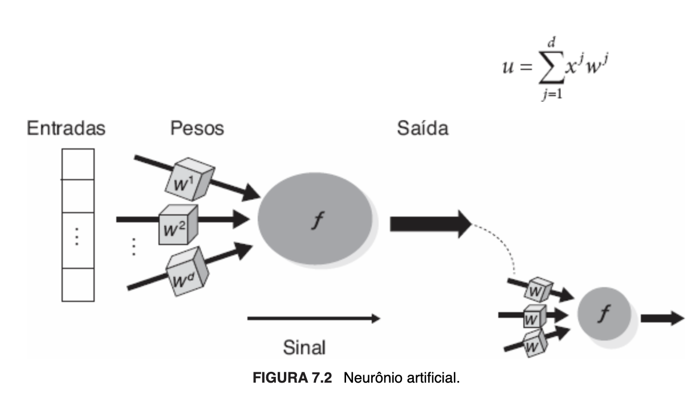
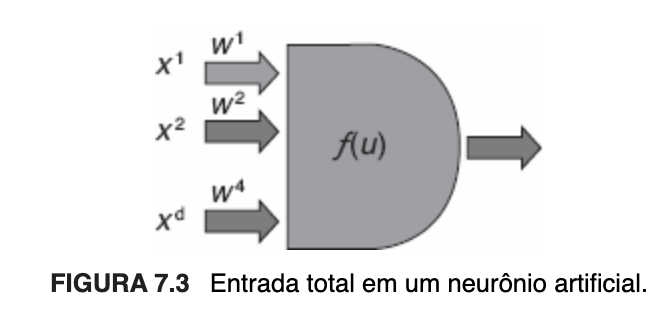

# # 2.7 Capítulo 7 (p. 101/116)

## Parte 2 | Modelos preditivos (capítulos 4 a 10)

### 7. Métodos conexionistas

São métodos inspirados em modelos biológicos, que buscam não apenas **simular o funcionamento** do sistema nervoso humano e o modo como o cérebro **adquire novos conhecimentos** — ou seja, seu **processo de aprendizado** —, mas alcançar **capacidade de processamento** semelhante e obter **máquinas inteligentes ou que se comportem de maneira aparentemente inteligente.** Assim como o cérebro é composto por uma grande quantidade de neurônios interconectados, perfazendo redes neurais que funcionam em paralelo e trocam informações através de sinapses[^1], as redes neurais artificiais (RNAs) são formadas por unidades que implementam funções matemáticas a fim de simular a atividade neuronal e, de modo geral, **abstraem a compreensão da fisiologia do cérebro e dos processos biológicos de aprendizagem.**

### 7.1 Redes neurais artificiais

>"A procura por modelos computacionais ou matemáticos do sistema nervoso teve início na mesma época em que foram desenvolvidos os primeiros computadores eletrônicos, na década de 1940. Os estudos pioneiros na área foram realizados por McCulloch e Pitts (1943)[^2]. Em 1943, eles propuseram um modelo matemático de neurônio artificial, a unidade lógica com limiar (LTU, do inglês *Logic Threshold Unit*), que podia executar funções lógicas simples. McCulloch e Pitts mostraram que a combinação de vários neurônios artificiais em sistemas neurais tem um elevado poder computacional, pois pode implementar qualquer função obtida pela combinação de funções lógicas. Entretanto, redes de LTUs não possuíam capacidade de aprendizado. [...] Na década de 1970, houve um resfriamento das pesquisas em RNAs, principalmente com a [...] limitação da rede Perceptron a problemas linearmente separáveis. Na década de 1980, o aumento da capacidade de processamento, as pesquisas em processamento paralelo e, principalmente, a proposta de novas arquiteturas de RNAs com maior capacidade de representação e de algoritmos de aprendizado mais sofisticados levaram ao ressurgimento da área." (FACELI et al., 2023, p. 102).

É possível definir as redes neurais artificiais como

>"[...] sistemas computacionais distribuídos compostos de unidades de processamento simples, densamente interconectadas [...], conhecidas como neurônios artificiais, [que] computam funções matemáticas [...]. As unidades [neurônios artificiais] são dispostas em uma ou mais camadas e interligadas por um grande número de conexões, geralmente unidirecionais. Na maioria das arquiteturas, essas conexões, que simulam as sinapses biológicas, possuem pesos associados, que ponderam a entrada recebida por cada neurônio da rede [...] [e] podem assumir valores positivos ou negativos, dependendo de o comportamento da conexão ser excitatório ou inibitório, respectivamente. Os pesos têm seus valores ajustados em um processo de aprendizado e codificam o conhecimento adquirido pela rede (Braga et al., 2007)." (FACELI et al., 2023, p. 103).

Seus **componentes básicos** são **arquitetura** e **aprendizado**. "Enquanto a arquitetura está relacionada com o tipo, o número de unidades de processamento e a forma como os neurônios estão conectados, o aprendizado diz respeito às regras utilizadas para ajustar os pesos da rede e à informação que é utilizada por essas regras." (FACELI et al., 2023, p. 103).

**O neurônio artificial é a unidade de processamento e componente fundamental da arquitetura de uma RNA.** Ele possui terminais de entrada que recebem os valores, uma função matemática que realiza o processamento desses valores já ponderados e um terminal de saída que corresponde à resposta do neurônio, alusivos, respectivamente, aos dendritos, corpo celular e axônios de um neurônio biológico. A cada terminal de entrada corresponde um peso sináptico, sendo a entrada total, sobre a qual a função de ativação é aplicada, definida pelo somatório de cada um dos valores de entrada multiplicado pelo peso vinculado à conexão respectiva. Os terminais de entrada podem ter pesos positivos, negativos ou zero, neste caso indicativo de que nenhuma conexão foi associada.

A seguir, imagens ilustrativas de um neurônio artificial:

Figura 23 — Ilustração de um neurônio artificial simples (FACELI et al., 2023, p. 103).

Figura 24 — Entrada total de um neurônio artificial (FACELI et al., 2023, p. 104).

## Principais tópicos

- **Noções gerais**
  - Inspiração biológica
    - Simulam o funcionamento de uma rede neural biológica para alcançar capacidade computacional similar à do cérebro humano, com o objetivo de obter máquinas inteligentes e/ou capazes de emitir comportamentos aparentemente inteligentes
  - Unidades de processamento simples implementam funções matemáticas a fim de resolver problemas complexos
- **Redes neurais artificiais**
  - Modelo de McCulloch e Pitts (1943)
    - Primeiro modelo matemático de neurônio artificial
    - A função de ativação é uma função limiar
    - Unidade lógica com limiar (*Logic Threshold Unit*, LTU)
      - Executava funções lógicas simples
      - Redes de LTUs tinham elevado poder computacional para a época, pois podiam implementar qualquer função obtida pela combinação de funções lógicas, mas não possuíam capacidade de aprendizado
  - **Componentes básicos de uma RNA**
    - **Aprendizado**
      - Regras de ajuste dos pesos sinápticos
    - **Arquitetura**
      - Estrutura da rede (tipo, quantidade e disposição dos neurônios)
      - **Neurônio artificial**
        - Unidade de processamento e principal componente arquitetural
        - Terminais de entrada, pesos, função de ativação e terminal de saída
        - A entrada total é a soma ponderada de todos os valores de entrada e é sobre ela que a função de ativação é aplicada

## Referências complementares

BOCCATO, Levy; ATTUX, Romis. **Tópico 6 — parte 1: redes neurais artificiais**. Departamento de Engenharia de Computação e Automação. Faculdade de Engenharia Elétrica e de Computação. Universidade Estadual de Campinas. Disponível em <https://www.dca.fee.unicamp.br/~lboccato/topico_6.1_redes_neurais.pdf>. Acesso em 19 jul. 2024.

LEMES, Nelson H. T. **Neurônio de McCulloch-Pitts**. Instituto de Química. Universidade Federal de Alfenas. Disponível em <https://pessoas.unifal-mg.edu.br/nelsonlemes/neuronio-de-mcculloch-pitts/>. Acesso em 19 jul. 2024.

McCULLOCH, Warren S.; PITTS, Walter. **A logical calculus of ideas immanent in nervous activity**. *Reprinted from the Bulletin of Mathematical Biophysics*, v. 5, p. 115-133 (1943). *Bulletin of Mathematical Biology*, v. 52, n. 1/2, p. 99/115. *Great Britain*: Pergamon Press PLC, 1990.

## Notas

[^1]: "O principal bloco de construção do cérebro é o neurônio. Os principais componentes de um neurônio são: dendritos, corpo celular e axônio. [...] Os dendritos são prolongamentos dos neurônio especializados na recepção de estímulos nervosos provenientes de outros neurônios ou do ambiente. Esses estímulos são então transmitidos para o corpo celular ou soma. O soma coleta as informações recebidas dos dendritos, as combina e processa. De acordo com a intensidade e frequência dos estímulos recebidos, o corpo celular gera um novo impulso, que é enviado para o axônio. O axônio é um prolongamento dos neurônios, responsável pela condução dos impulsos elétricos produzidos no corpo celular até outro local mais distante [...]. O contato entre a terminação de um axônio e o dendrito de outro neurônio é denominado sinapse. As sinapses são, portanto, as unidades que medeiam as interações entre os neurônios [...] e podem ser excitatórias ou inibitórias." (FACELI et al., 2023, p. 102/103).

[^2]: No artigo intitulado "*A Logical Calculus of Ideas Immanent in Nervous Activity*", publicado em 1943 no *Bulletin of Mathematical Biophysics*, Warren McCulloch e Walter Pitts, ainda que simplificadamente, propuseram o primeiro modelo computacional/matemático de um neurônio biológico. À luz do conhecimento científico que se tinha àquele momento sobre a estrutura e o funcionamento das células nervosas, o trabalho foi norteado pelo estabelecimento das seguintes premissas: **(1) a atividade do neurônio é um processo "tudo ou nada"** (*"all-or-none" process*); **(2) a ativação do neurônio exige que impulsos elétricos sejam recebidos em um período (latência) por uma determinada quantidade de sinapses**, que não se altera em razão da atividade prévia e/ou do estado da célula; **(3) o atraso sináptico foi o único intervalo de tempo considerado para induzir o modelo**, desprezando-se outros inerentes à geração e/ou transmissão de impulsos pelo sistema nervoso, pois irrelevantes; **(4) sinapses inibitórias impedem a ativação do neurônio naquele instante** (período refratário); e **(5) a estrutura da rede neural é invariante ao tempo**, assim como seus componentes. Noutras palavras, partiram da assunção de que o processo computacional é binário, admitindo apenas dois estados não concomitantes — ativo/ligado e inativo/desligado —, mas invariante ao mero decurso do tempo na medida em que mudam de estado tão somente se verificada determinada condição, de modo que a qualquer instante o limiar de ativação, que é determinado pelo próprio neurônio e não por quaisquer características inerentes ao estímulo recebido, deve ser excedido em uma janela de latência para que o neurônio seja ativado. Os autores demonstraram que seu modelo era capaz de representar quaisquer proposições elementares e que, implementados em rede, conseguiriam calcular lógicas complexas. Não obstante, observaram limitações diante de disjunções exclusivas e que a incapacidade de modificar, extinguir ou criar sinapses impedia o processo de aprendizagem. Como se vê, o modelo constitui uma abstração da verdadeira fisiologia do sistema nervoso biológico.
