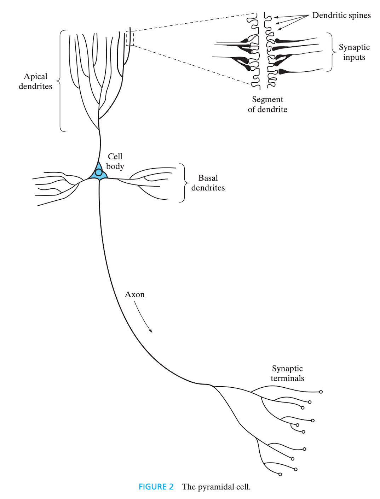
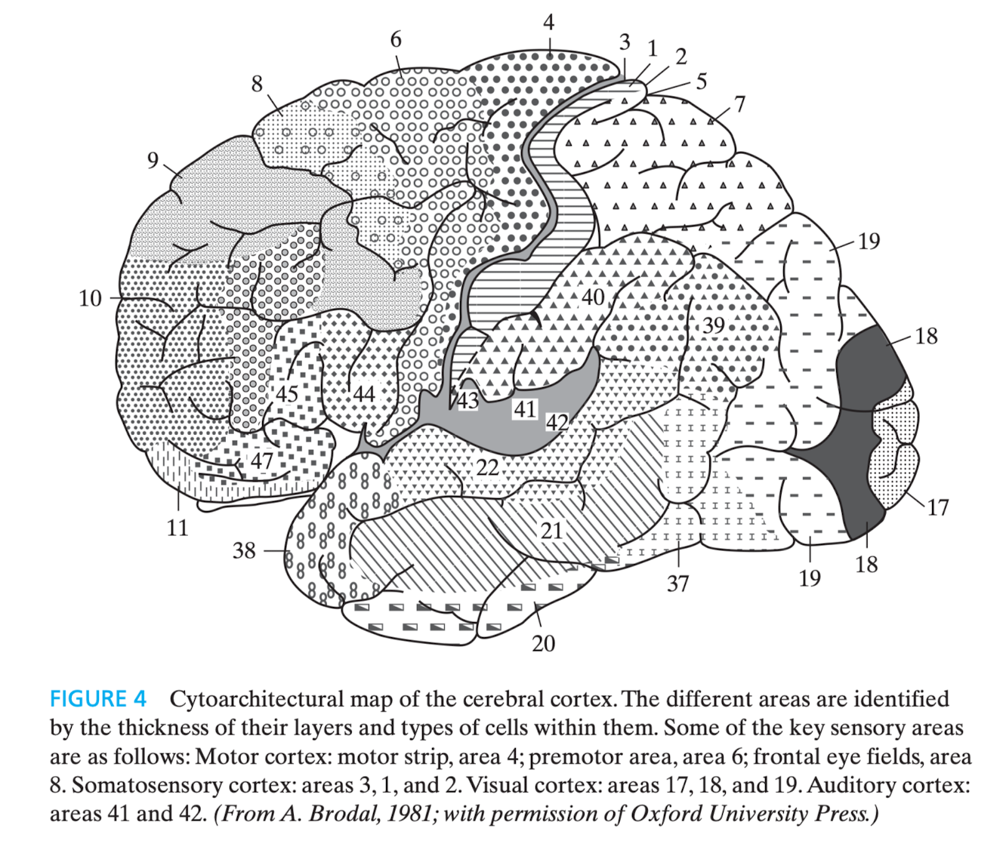
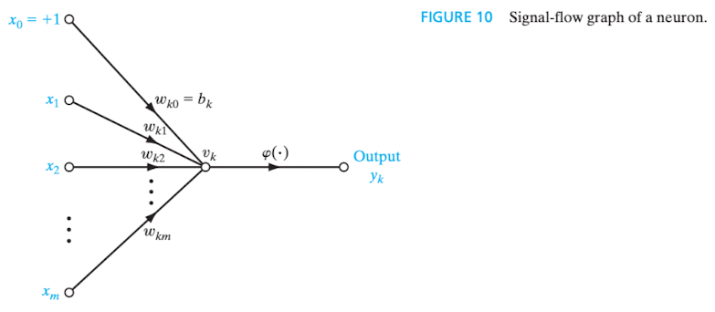
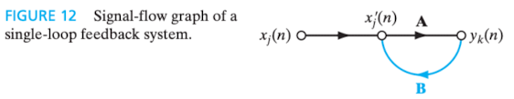
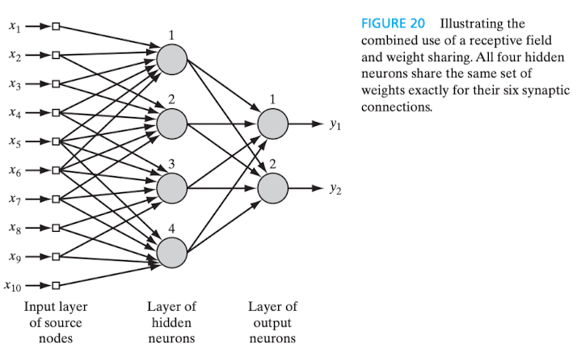
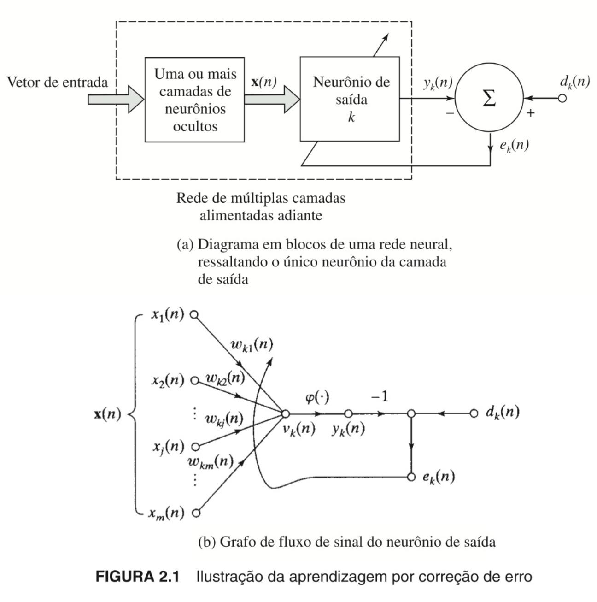

# # 1.2 Introdução (p. 1/46)

## 1. Definição de rede neural [^1]

Desde o início, o estudo das redes neurais artificiais foi pautado pela observação de que tanto o cérebro humano quanto os computadores convencionais são sistemas de processamento de informações[^2] e, por conseguinte, realizam trabalho computacional[^3]. Não apenas seu funcionamento é bastante distinto, mas a capacidade computacional do cérebro - não só humano, mas também o de outros animais - supera, em muito, a dos computadores digitais.

O cérebro é um sistema de processamento de informações complexo, não linear e paralelo[^4]. Suas estruturas fundamentais são os neurônios, organizados de modo a realizar tarefas computacionais, a exemplo do reconhecimento de padrões. Portanto, assim no cérebro como nas redes artificiais, os neurônios constituem as unidades de processamento da informação.

A plasticidade[^5], característica que permite a adaptação do indivíduo ao ambiente em que está inserido, também é importante para as redes neurais artificiais.

Em linhas gerais, pode-se dizer que uma rede neural artificial é um modelo computacional inspirado no modo como o cérebro realiza o processamento de informações. Nas palavras de Haykin (2009, p. 2), "[...] a neural network is a machine that is designed to model the way in which the brain performs a particular task or function of interest".

Já como definição formal, o autor dá às redes neurais, vistas como uma máquina adaptativa[^6], o seguinte conceito:
> "A neural network is a massively parallel distributed processor made up of simple processing units that has a natural propensity for storing experiential knowledge and making it available for use. It resembles the brain in two respects: 1. Knowledge is acquired by the network from its environment through a learning process. 2. Interneuron connection strengths, known as synaptic weights, are used to store the acquired knowledge." (HAYKIN, 2009, p. 2)

Em português, conforme definição dada na edição anterior do livro:
> "Uma rede neural é um processador maciçamente paralelamente distribuído constituído de unidades de processamento simples, que tem uma propensão natural para armazenar conhecimento experimental e torná-lo disponível para uso. Ela se assemelha ao cérebro em dois aspectos: 1. O conhecimento é adquirido pela rede a partir de seu ambiente através de um processo de aprendizagem. 2. Forças de conexão entre os neurônios, conhecidas como pesos sinápticos, são utilizadas para armazenar o conhecimento adquirido." (HAYKIN, 2001, p. 28)

Assim, na medida do possível, as redes neurais artificiais assemelham-se e são modeladas à luz do cérebro humano [interconexão de unidades computacionais simples - neurônios - assim no cérebro biológico, como nas redes neurais artificiais].

O processo de aprendizagem - **algoritmo de aprendizagem** - tradicionalmente aplicado em redes neurais consiste na **modificação dos pesos sinápticos** das conexões neuronais e deve necessariamente resultar em **atividade computacional útil**, ou seja, o alcance do objetivo almejado.

A rede neural pode alterar sua própria estrutura (topologia).

Conforme o autor, a técnica de modificação dos pesos sinápticos guarda muita similaridade com a teoria dos filtros adaptativos lineares (*linear adaptive filter theory*) [^7].

### 1.1 Benefícios das redes neurais

A capacidade computacional das redes neurais é resultado de sua estrutura massiva e paralelamente distribuída, bem como da habilidade de aprender e generalizar. "A generalização se refere ao fato de a rede neural produzir saídas adequadas para entradas que não estavam presentes durante o treinamento (aprendizagem). Estas duas capacidades de processamento de informação [aprender e generalizar] tornam possível para as redes neurais resolver problemas complexos (de grande escala) que são atualmente intratáveis." (HAYKIN, 2001, p. 28)

> "A generalização se refere ao fato de a rede neural produzir saídas adequadas para entradas que não estavam presentes durante o treinamento (aprendizagem)" (HAYKIN, 2001, p. 28).

> "Generalization refers to the neural network's production of reasonable outputs for inputs not encountered during training (learning) (HAYKIN, 2009, p. 2)".

São produzidas saídas (*outputs*) adequadas para as entradas (*inputs*) fornecidas - *good approximate solutions*, do original em inglês (Haykin, 2009). Atualmente, o problema grande e complexo deve ser decomposto em problemas menores, os quais redes neurais de propósito específico têm capacidade de resolver.

Principais capacidades e propriedades das redes neurais artificiais (p. 2/6):

- Não linearidade (embora individualmente os neurônios artificiais possam ser lineares ou não lineares);
- Mapeamento de entrada e saída (na aprendizagem supervisionada);
- Adaptabilidade (capacidade de modificar os pesos sinápticos);
  - **Dilema estabilidade x plasticidade:** "Para aproveitar todos os benefícios da adaptabilidade, as constantes de tempo principais do sistema devem ser grandes o suficiente para que o sistema ignore perturbações espúrias mas ainda assim serem suficientemente pequenas para responder a mudanças significativas no ambiente" (HAYKIN, 2001, p. 30).
- Resposta a evidências (não apenas classificar o padrão adequadamente, mas informar o nível de confiabilidade da escolha, rejeitando ambiguidade);
- Informação contextualizada ("O conhecimento é representado pela própria estrutura e estado de ativação de uma rede neural." (HAYKIN, 2001, p. 30));
- Tolerância a falhas (devido à sua estrutura massiva e paralelamente distribuída);
- Implementação em VSLI (*very-large-scale-integration*) [^8];
- Uniformidade de análise e projeto ("[...] as redes neurais desfrutam de universalidade como processadores de informação" (HAYKIN, 2001, p. 30));
- Analogia neurobiológica (motivadas por estruturas biológicas do cérebro humano).

## 2. O cérebro humano [^9]

O sistema nervoso humano pode ser visto como um sistema de três estágios, do qual fazem parte cérebro, receptores e atuadores. Os estímulos - entrada (*input*) do sistema - são captados e convertidos em sinais elétricos pelos receptores; o cérebro continuamente recebe e processa esses sinais; os atuadores convertem os sinais recebidos de modo a gerar as ações (respostas) apropriadas, que constituem a saída (*output*) do sistema. A informação captada é transmitida em um único sentido - receptor > cérebro > atuador -, mas o sistema se retroalimenta no sentido oposto dessa transmissão - atuador > cérebro > receptor (*feedback*).

Foi o trabalho de Santiago Ramón y Cajal que, em 1911, introduziu o neurônio como estrutura fundamental do cérebro. Os neurônios são cinco a seis ordens de grandeza mais lentos do que os circuitos digitais e, ainda assim, o cérebro é muito mais eficiente do que computadores em termos de eficiência energética. Provavelmente, isso é resultado da enorme quantidade de células neuronais e à massiva interconexão entre elas - a eficiência energética do cérebro humano é de $10^{-16}$ joules por operação por segundo. Eles se apresentam sob diversas formas e tamanhos, sendo que um dos mais comuns é a denominada célula piramidal, e se organizam na anatomia cerebral em diversos níveis e em pequena ou grande escala.

Figura 1 - Célula piramidal (HAYKIN, 2009, p. 8)

Essa estrutura hierárquica vai, em menor nível, das moléculas responsáveis pelas sinapses ao próprio sistema nervoso central, último nível hierárquico. A estrutura completa é apresentada por Haykin (2009, p. 9), na figura 3, da seguinte forma: moléculas > sinapses > microcircuitos neurais > árvore dendrítica > neurônio > circuitos locais > circuitos regionais > sistema nervoso central.

Figura 2 - Célula piramidal (HAYKIN, 2009, p. 10)

> "The synapses represent the most fundamental level, depending on molecules and ions for their action. [...] A neural microcircuit refers to an assembly of synapses organized into patterns of connectivity to produce a functional operation of interest. A neural microcircuit may be likened to a silicon chip made up of an assembly of transistors. At the next level of complexity, we have local circuits [...] made up of neurons with similar or different properties; there neural assemblies perform operations characteristic of a localized region in the brain. They are followed by interregional circuits made up of pathways, columns, and topographic maps, which involve multiple regions located in different parts of the brain. Topographic maps are organized to respond to incoming sensory information. These maps are often arranged in sheets, [...] stacked in adjacent layers in such a way that stimuli from corresponding points in space lie above or below each other. [...] different sensory inputs [...] are mapped onto corresponding areas of the cerebral cortex in an orderly fashion. At the final level of complexity, the topographic maps and other interregional circuits mediate specific types of behavior in the central nervous system." (HAYKIN, 2009, p. 7/9)

O equivalente, na 2 edição, em português:
> "As sinapses representam o nível mais fundamental, dependente de moléculas e íons para sua ação. [...] Um microcircuito neural se refere a um agrupamento de sinapses organizadas em padrões de conectividade para produzir uma operação funcional de interesse. Um microcircuito neural pode ser comparado a um circuito de silício constituído por um agrupamento de transistores. [...] No nível seguinte de complexidade nós temos circuitos locais [...] constituídos por neurônios com propriedades similares ou diferentes; estes agrupamentos neurais realizam operações características de uma região localizada no cérebro. Eles são seguidos por circuitos inter-regionais constituídos por caminhos, colunas e mapas topográficos, que envolvem regiões múltiplas localizadas em partes diferentes do cérebro. Os mapas topográficos são organizados para responder à informação sensorial incidente. Estes mapas são frequentemente arranjados em folhas, [...] empilhados em camadas adjacentes de tal modo que estímulos advindos de pontos correspondentes no espaço se localizem acima ou abaixo de cada um deles. [...] diferentes entradas sensoriais [...] são mapeadas sobre áreas correspondentes do córtex cerebral de forma ordenada. No nível final de complexidade, os mapas topográficos e outros circuitos inter-regionais medeiam tipos específicos de comportamento no sistema nervoso central." (HAYKIN, 2001, p. 33/36)

As sinapses são unidades estruturais e funcionais elementares responsáveis por intermediar a comunicação entre neurônios[^10] e, em maioria, são químicas. Nelas, um sinal elétrico pré-sináptico é transformado em sinal químico pela liberação de neurotransmissores, e depois se converte novamente em sinal elétrico, pós-sináptico (Shepherd; Koch, 1990 *apud* Haykin, 2009). "Nas descrições tradicionais da organização neural, assume-se que uma sinapse é uma conexão simples que pode impor ao neurônio receptivo excitação ou inibição, mas não ambas." (HAYKIN, 2001, p. 33). **O surgimento de novas sinapses ou a modificação das já existentes são os mecanismos responsáveis pela plasticidade cerebral e, consequentemente, pela aprendizagem.**

A saída (*output*) do processamento neuronal são, no mais das vezes, impulsos elétricos denominados **potenciais de ação**[^9] ou ***spikes*** - na 2 edição, em português, o termo é traduzido como **impulso**.

## 3. Modelos de neurônio [artificial]

Em sua forma mais rudimentar, o modelo de um neurônio artificial possui três elementos básicos: um **conjunto de sinapses ou elos de ligação (*synapses or connecting links*)**, cada um com seu próprio peso ou força (peso sináptico/*synaptic weight*) [^11]; um **somador (*adder*)**; e uma **função de ativação (*activation function*)**.

Eis a representação gráfica do modelo (HAYKIN, 2009, p. 11):
 
Figura 3 - Modelo de neurônio artificial não linear representado por diagrama em blocos

Trata-se do **modelo de um neurônio artificial não linear representado por *diagrama em blocos***. Como se verá até ao final desta seção, o diagrama em blocos é uma das formas de representar graficamente uma rede neural artificial.

Depreende-se que um sinal de **entrada** - representado pela letra $x$ - é direcionado à sinapse - representada pela letra $j$ -, que está conectada ao neurônio - representado pela letra $k$ - e que, por sua vez, possui um peso sináptico - representado pela letra $w$. Noutras palavras, considerados quaisquer índices, diz-se que "[...] um sinal $x_j$ na entrada da sinapse $j$ conectada ao neurônio $k$ é multiplicada pelo peso sináptico $w_{kj}$. [...] O primeiro índice se refere ao neurônio em questão e o segundo se refere ao terminal de entrada da sinapse à qual o peso se refere." (HAYKIN, 2001, p. 36).

O somatório dos sinais de entrada ponderados pelos pesos sinápticos de cada neurônio pode, ou não, executar a função de ativação, que visa "restringir a amplitude da saída de um neurônio. A função de ativação é também referida como *função restritiva* já que restringe (limita) o intervalo permissível de amplitude do sinal de saída a um valor finito. Tipicamente, o intervalo normalizado da amplitude da saída de um neurônio é escrito como o intervalo unitário fechado [0, 1] ou alternativamente [-1, 1]" (HAYKIN, 2001, p. 37). Na terminologia em inglês, a dita função restritiva é denominada *squashing function* (HAYKIN, 2009, p. 10).

O resultado - saída/*output* - do cálculo realizado pelo somador (na figura, *summing junction*) descreve um **combinador linear (*linear combiner*)**, representado pela letra $u$ (não aparece no modelo acima), que consiste na soma dos valores da entrada do sistema multiplicada pelo peso sináptico do neurônio.

Pode ser considerado no cálculo o ***bias*** (**viés**, em tradução literal), que "tem o efeito de aumentar ou diminuir a entrada líquida da função de ativação, dependendo se ele é positivo ou negativo, respectivamente" (HAYKIN, 2001, p. 37). No modelo acima, é representado por $b_k$, do que se infere que **cada neurônio pode ter um viés específico**. Tem-se, ainda, que o *bias* aplica uma **transformação afim** (*affine transformation*, em inglês) **à saída do somador, que equivale à entrada líquida da função de ativação.**

A saída do combinador linear - $u_k$ -, após a incidência do *bias* - $b_k$ -, se for o caso, é a **entrada líquida (*net input*) da função de ativação**. Esta, por sua vez, é representada na imagem por $\phi(\cdot)$ e sua aplicação resulta na saída (*output*) do próprio neurônio, representada pela letra $y$.

Portanto, **para o neurônio $k$, sua saída é dada por $y_k = \phi(u_k + b_k)$, cujos parâmetros são a saída do combinador linear ($u_k$) e o *bias* do neurônio ($b_k$).**

Até aqui, a representação matemática do neurônio $k$ é dada por:

$$
u_k = \sum_{j=1}^{m} w_{kj}x_j
$$

e

$$
y_k = \phi(u_k + b_k)
$$

A equação

$$
v_k = u_k + b_k
$$

mostra que o **campo local induzido (*induced local field*) ou potencial de ativação (*activation potential*)**[^12], representado pela letra $v$, do neurônio $k$ tem correlação com a saída do combinador linear - $u_k$ - e o *bias* - $b_k$ -, de modo a deslocar o gráfico da equação a depender se o valor do *bias* é positivo ou negativo.

### 3.1 Tipos de funções de ativação

#### 3.1.1 Função de limiar ou limite (*threshold function*)

É empregada no modelo de McCulloch-Pitts, no qual "a saída de um neurônio assume o valor de 1, se o campo local induzido daquele neurônio é não-negativo, e 0 caso contrário." (HAYKIN, 2001, p. 39). É um modelo determinístico.

Em notação matemática, representa-se a função por

$$
\phi(v) = \left\{
\begin{array}{ll}
1 & \text{se } v \geq 0 \\
0 & \text{se } v < 0
\end{array}
\right.
$$

Para a saída $y_k$ do neurônio, temos que

$$
y(k) = \left\{
\begin{array}{ll}
1 & \text{se } v \geq 0 \\
0 & \text{se } v < 0
\end{array}
\right.
$$

Para esse neurônio, o campo local induzido ou potencial de ativação é dado por

$$
v_k = \sum_{j=1}^{m} w_{kj}x_j + b_k
$$

#### 3.1.2 Função sigmoide

É a mais comumente utilizada na construção de redes neurais. "Ela é definida como uma função estritamente crescente que exige um balanceamento adequado entre comportamento linear e não-linear" (HAYKIN, 2001, p. 40), de modo que pode assumir valores contínuos no intervalo $[0, 1]$. Essa função é diferenciável.

Nos casos em que seja interessante que os valores da função de ativação se estenda de $-1$ a $+1$, em vez de $0$ a $+1$, tem-se a denominada **função sinal (*signum function*)**, que obedece à regra

$$
\phi(v) = \left\{
\begin{array}{}
1, & \text{se } v > 0 \\
0, & \text{se } v = 0 \\
-1, & \text{se } v < 0
\end{array}
\right.
$$

, e sua função sigmoide (função tangente hiperbólica) é dada por

$$
\phi(v) = tanh(v)
$$

### 3.2 Modelo estocástico de neurônio

Adição de uma variável aleatória ao modelo de McCulloch-Pitts, que é determinístico, de modo a torná-lo estocástico, isto é, probabilístico. Isso porque um modelo estocástico de neurônio tenta predizer possíveis resultados (saídas) levando em consideração a existência de um ou mais parâmetros variáveis ao longo do tempo. Ao contrário, em um modelo determinístico, as saídas devem ser sempre as mesmas para os mesmos valores de entrada.

Se $x$ representar o estado de um neurônio, $v$ o seu potencial de ativação e $P(v)$ a probabilidade de **disparo**, isto é, de que **ocorra mudança de estado**, tem-se que

$$
x = \left\{
\begin{array}{ll}
+1 & \text{com probabilidade } P(v) \\
-1 & \text{com probabilidade } 1 - P(v)
\end{array}
\right.
$$

, e que

$$
P(v) = \frac{1}{1 + exp(-v/T)}
$$

, em que $T$ é a dita **pseudotemperatura**, "[...] utilizada para controlar o nível de ruído e portanto a incerteza de disparar [...] como um parâmetro que controle as flutuações térmicas que representam os efeitos do ruído sináptico. Note que quando $T \rightarrow 0$, o neurônio estocástico [...] se reduz a uma forma sem ruído (i.e., determinística), que é o modelo de McCulloch-Pitts." (HAYKIN, 2001, p. 41).

### 3.3 Redes neurais como grafos dirigidos [^13] [^14]

> "A signal-flow graph is a network of directed *links (branches)* that are interconnected at certain points called *nodes*. A typical node $j$ has an associated node signal $x_j$. A typical directed link originates at node $j$ and terminates on node $k$; it has an associated *transfer function*, or *transmittance*, that specifies the manner in which the signal $y_k$ at node $k$ dependes on the signal $x_j$ at node $j$." (HAYKIN, 2009, p. 15)

Na edição em português:
> "Um *grafo de fluxo de sinal* é uma rede de *elos (ramos)* orientados que são interligados em certos pontos chamados *nós*. Um nó típico $j$ tem um sinal nodal $x_j$ associado. Um elo orientado típico origina-se no nó $j$ e termina no nó $k$; ele tem uma *função de transferência* ou *transmitância* associada que especifica a maneira pela qual o sinal $y_k$ no nó $k$ depende do sinal $x_j$ no nó $j$." (HAYKIN, 2001, p. 41)

O fluxo dos sinais obedece a três regras básicas:
1.**Um sinal flui ao longo de um elo somente no sentido definido pela seta do elo**, distinguindo-se dois tipos de elos (*links*):
  - **Elos sinápticos (*synaptic links*)**, regido por uma relação linear de entrada-saída (*input-output*);
  - **Elos de ativação (*activation links*)**, regido por uma relação não-linear de entrada-saída.
2.**Um sinal nodal é igual à soma algébrica de todos os sinais que entram no nó pertinente via os elos incidentes**.
3.**O sinal de um nó é transmitido para cada elo de saída originário deste nó, sendo a transmissão inteiramente independente das funções de transferência dos elos de saída**.

A não-linearidade nos elos de ativação é fator limitante da utilização do modelo.

O grafo de fluxo de sinal construído a partir dessas regras é o seguinte (HAYKIN, 2009, p. 17):

Figura 4 - Grafo de fluxo de sinal de um neurônio

Com base no modelo acima, extrai-se a seguinte **definição matemática de uma rede neural**:
> "A neural network is a directed graph consisting of nodes with interconnecting synaptic and activation links and is characterized by four properties: 1. Each neuron is represented by a set of linear synaptic links, an externally applied bias, and a possibly nonlinear activation link. The bias is represented by a synaptic link connected to an input fixed at +1. 2. The synaptic links of a neuron weight their respective input signals. 3. The weighted sum of the input signals defines the induces local field of the neuron in question. 4. The activation link squashes the induced local field of the neuron to produce an output." (HAYKIN, 2009, p. 16/17)

Da edição anterior, em português:
> "Uma rede neural é um grafo orientado constituído de nós com elos de interligação sinápticos e de ativação e é caracterizado por quatro propriedades: 1. Cada neurônio é representado por um conjunto de elos sinápticos lineares, um bias aplicado externamente e um elo de ativação possivelmente não-linear. O bias é representado por um elo sináptico conectado a uma entrada fixada em +1. 2. Os elos sinápticos de um neurônio ponderam seus respectivos sinais de entrada. 3. A soma ponderada dos sinais de entrada define o campo local induzido do neurônio em questão. 4. O elo de ativação limita o campo local induzido do neurônio para produzir uma saída." (HAYKIN, 2001, p. 43)

O grafo referido na figura 4 é dito **completo** porque descreve o fluxo do sinal entre os neurônios e dentro de cada neurônio. Por outro lado, diz-se que o grafo **parcialmente completo** é aquele que expõe apenas o fluxo inter-neuronal, caso em que é referido como **grafo arquitetural (*architectural graph*)**, pois expressa uma espécie de planta da rede neural.

Figura 5 - Grafo arquitetural

### 3.4 As três representações gráficas de uma rede neural [^15]

- **Diagrama em blocos** (*block diagram*), que oferece uma descrição funcional da rede, conforme a figura 3;
- **Grafo de fluxo de sinal** (*signal-flow graph*), que oferece uma descrição completa do fluxo dos sinais entre os neurônios e dentro de cada neurônio da rede, conforme a figura 4;
- **Grafo arquitetural** (*architectural graph*), que oferece uma descrição estrutural, como uma planta baixa da rede, conforme a figura 5.

## 5. Feedback (Realimentação)

> "Feedback is said to exist in a dynamic system whenever the output of an element in the system influences in part the input applied to that particular element, thereby giving rise to one or more closed paths for the transmission of signals around the system." (HAYKIN, 2009, p. 18)

Na edição em português:

> "Dizemos que existe realimentação em um sistema dinâmico [^16] sempre que a saída de um elemento no sistema influencia em parte a entrada aplicada àquele elemento particular, originando assim um ou mais de um caminho fechado para transmissão de sinais em torno do sistema." (HAYKIN, 2001, p. 44)

Ocorre no sistema nervoso dos animais. Tem posição de destaque em redes neurais recorrentes (RNN - *recurrent neural networks*), embora a não linearidade das unidades de processamento prejudique sua aplicação.

O comportamento dinâmico da rede é controlado pelo ajuste dos pesos sinápticos [^17], de modo que, se $|w| < 1$, o sinal de saída é **exponencialmente convergente** e a rede é dita **estável**; se $|w| \geq 1$, o sinal de saída é **divergente** e a rede é dita **instável**. Neste caso, se $|w| = 1$, a divergência é **linear** e, se $|w| > 1$, **exponencial**.

O grafo de fluxo de sinal que mostra o modelo mais simples de um sistema realimentado é o seguinte (HAYKIN, 2009, p. 19):

Figura 6 - Grafo de fluxo de sinal de um sistema realimentado com laço único

## 6. Arquiteturas de redes neurais (*Network architectures*)

A forma de organização neuronal da rede é fortemente correlacionada ao algoritmo de aprendizagem utilizado para o treinamento. **Só é considerado um neurônio, ou nó da camada, se houver trabalho computacional.**

De modo geral, Haykin afirma que os padrões de arquitetura de redes neurais constituem três grandes categorias:

1. ***Single-Layer Feed-forward Networks*** (Redes alimentadas adiante com camada única, na edição em português);
2. ***Multilayer Feed-forward Networks*** (Redes alimentadas diretamente com múltiplas camadas, na edição em português); e
3. ***Recurrent Networks*** (Redes recorrentes, na edição em português).

### 6.1 Single-Layer Feed-forward Networks

Nas redes neurais em camadas, como o nome sugere, os neurônios são organizados em camadas.

Este é o modelo arquitetural mais simples e é dito que possui uma única camada, em referência à própria camada de saída (*output layer*) dos neurônios, pois somente esta realiza atividade computacional. Não há camadas intermediárias escondidas (*hidden layers*) e é denominada **alimentada adiante (*feed-forward*)**, ou acíclica, porque o fluxo dos sinais é **unidirecional**, isto é, **não há realimentação**.

Figura 7 - Single-Layer Feed-forward Network. Fonte: HAYKIN, 2009, p. 21

### 6.2 Multilayer Feed-forward Networks

Possui uma ou mais camadas ocultas (*hidden layers*), compostas por neurônios ou unidades ocultos(as), cuja função "[...] é intervir entre a entrada externa e a saída da rede de maneira útil" (HAYKIN, 2001, p. 47). A adição de mais camadas ocultas aumenta o poder computacional da rede.

Nesse sentido, "in a rather loose sense, the network acquires a global perspective despite its local connectivity, due to the extra set of synaptic connections and the extra dimension of neural interactions (Churchland and Sejnowski, 1992)" (HAYKIN, 2009, p. 22).

Da edição anterior, em português, extrai-se que "em um sentido bastante livre, a rede adquire uma perspectiva global apesar de sua conectividade local, devido ao conjunto extra de conexões sinápticas e da dimensão extra de interações neurais (Churchland e Sejnowski, 1992)" (HAYKIN, 2001, p. 47).

Os nós da camada mais externa recebem os sinais de entrada e os direcionam à camada seguinte, isto é, a primeira camada oculta, que os processa e encaminha à próxima camada, seguindo-se assim sucessivamente, até que cheguem à camada de saída. Em regra, os sinais de entrada das camadas internas são limitados aos próprios sinais de saída da camada imediatamente anterior.

Na imagem a seguir, tem-se um exemplo de rede neural com uma camada oculta composta por quatro neurônios, a qual é referida como uma rede 10-4-2, ou seja, 10 neurônios de entrada (fonte), 4 ocultos e 2 na camada de saída.

Figura 8 - Multilayer Feed-forward Network. Fonte: HAYKIN, 2009, p. 22.

Por conseguinte, uma rede com $m$ nós de entrada, $h_1$ neurônios na primeira camada oculta, $h_2$ neurônios na segunda camada oculta e $q$ neurônios na camada de saída é referida como uma rede $m-h_1-h_2-q$.

A rede apresentada na figura acima é dita **totalmente conectada** pois cada neurônio de uma camada está conectado a todos os neurônios da camada seguinte. Do contrário, se houvesse alguma conexão sináptica faltante, seria denominada **parcialmente conectada**.

### 6.3 Recurrent Networks

As redes modeladas neste estilo arquitetural possuem, pelo menos, um laço de realimentação (*feedback loop*). Essa característica reflete positivamente na capacidade de aprendizado e na performance da rede. Elas podem ou não ser auto-realimentadas (*self-feedback*), isto é, a saída de um neurônio pode ou não ser realimentada a sua própria entrada.

Abaixo, está exemplificada uma rede neural recorrente sem auto-realimentação e sem neurônios ocultos:

Figura 9 - Rede recorrente sem auto-realimentação e sem neurônios ocultos. Fonte: HAYKIN, 2009, p. 23.

Já a seguir, tem-se um exemplo de rede recorrente com neurônios ocultos:

Figura 10 - Rede recorrente com neurônios ocultos. Fonte: HAYKIN, 2009, p. 24.

Em ambos os casos, verifica-se a presença de elementos de atraso unitário (*unit-time delay elements*), nos laços de realimentação, representados por $z^{-1}$, com o objetivo de conferir comportamento dinâmico não-linear à rede.

## 7. Representação do conhecimento [^18]

"Knowledge refers to stored information or models used by a person or machine to interpret, predict, and appropriately respond to the outside world" (FISCHLER; FIRSCHEIN, 1987 apud HAYKIN, 2009, p. 24). Ou, na 2a edição, "Conhecimento se refere à informação armazenada ou a modelos utilizados por uma pessoa ou máquina para interpretar, prever e responder apropriadamente ao mundo exterior" (FISCHLER; FIRSCHEIN, 1987 apud HAYKIN, 2001, p. 49).

Suas duas principais características são "(1) que informação é realmente tornada explícita; e (2) como a informação é codificada fisicamente para o uso subsequente." (HAYKIN, 2001, p. 49). Além disso, deve ser direcionada a um objetivo.

"Em aplicações do mundo real de máquinas 'inteligentes', podemos dizer que uma boa solução depende de uma boa representação do conhecimento" (WOODS, 1986 apud HAYKIN, 2001, p. 49).

A rede neural deve ser capaz de aprender a respeito do mundo exterior - isto é, o ambiente no qual está inserida - e constantemente manter essa definição atualizada, de modo a atingir os objetivos específicos da aplicação. Destaca-se que esse conhecimento sobre o mundo consiste, basicamente, em dois tipos de informação:

>"1. O estado conhecido do mundo, representado pelos fatos sobre o que é e o que era conhecido; esta forma de conhecimento é chamada de *informação prévia*. 2. As observações (medidas) do mundo, obtidas por meio de sensores projetados para sondar o ambiente no qual a rede neural deve operar. Normalmente, estas observações são inerentemente ruidosas, sendo sujeitas a erros devido a ruído [^19] do sensor e imperfeições do sistema. De qualquer maneira, as observações que são assim obtidas fornecem o conjunto de informações de onde são retirados os *exemplos* utilizados para treinar a rede neural." (HAYKIN, 2001, p. 50)

Esses exemplos para treinamento podem ser **rotulados ou não rotulados**. No primeiro caso, ao sinal de entrada é associada a resposta esperada, enquanto que, no segundo, não há essa associação e o sinal de entrada é contraposto a ocorrências diferentes dele próprio. Em qualquer caso, **o conjunto de exemplos representa o conhecimento da rede neural sobre o ambiente.**

Também podem ser **positivos** ou **negativos**, isto é, respectivamente voltados a ensinar **o que deve ser reconhecido** e **o que deve ser ignorado**.

Ao par de dados entrada-saída, respectivamente correspondentes ao sinal de entrada e à resposta desejada, dá-se o nome de **conjunto de dados de treinamento ou amostra de treinamento (*set of training data or training sample*)**.

Nesse sentido, um possível projeto de uma rede neural teria duas fases, quais sejam, a de **aprendizagem (*learning*)**, na qual haveria a exposição ao conjunto de dados, e a de **generalização (*generalization*)**, depois da testagem bem-sucedida após o treinamento, que consiste na capacidade de repetir idêntica performance em cenários que envolvam dados que não foram apresentados durante o treinamento.

Diferentemente do que ocorre nos classificadores de padrões clássicos, "[...] a rede neural não somente fornece o modelo implícito do ambiente no qual ela está inserida, como também realiza a função de processamento de informação de interesse" (HAYKIN, 2001, p. 50).

A representação do conhecimento perpassa pelo ajuste dos pesos sinápticos e do *bias*, isto é, dos **parâmetros livres da rede**. "A forma dessa representação de conhecimento constitui o verdadeiro projeto da rede neural, e portanto é a chave para o seu desemprenho" (HAYKIN, 2001, p. 51).

### 7.1 Regras de representação do conhecimento

Há quatro regras comumente aceitas:

>"1. Entradas similares de classes similares normalmente devem produzir representações similares no interior da rede, e portanto devem ser classificadas como pertencentes à mesma categoria. 2. Devem ser atribuídas representações bem diferentes na rede a itens que devem ser categorizados como classes separadas. 3. Se uma característica particular é importante, então deve haver um grande número de neurônios envolvidos na representação daquele item na rede. 4. Informação prévia e invariâncias devem ser incorporadas no projeto de uma rede neural, simplificando com isso o projeto da rede por não ter que aprendê-las." (ANDERSON, 1988 apud HAYKIN, 2001, p. 51/53)

"Correlation plays a key role not only in the human brain, but also in signal processing of various kinds" (CHEN ET AL., 2007 apud HAYKIN, 2009, p. 28). Em tradução direta, "a correlação desempenha um papel fundamental não apenas no cérebro humano, mas também no processamento de sinais de vários tipos".

**Probabilidade de detecção vs. probabilidade de falso alarme** - Critério de Neyman-Pearson: "[...] a probabilidade de detecção é maximizada, sujeita à restrição de que a probabilidade de alarme falso não exceda a um determinado valor" (VAN TREES, 1968 apud HAYKIN, 2001, p. 53).

A regra 4 significa que é *altamente desejável* que a rede neural possua estrutura especializada (restrita), o que se justifica pelo fato de que há alta especialização em redes biológicas (visuais e auditivas, por exemplo), pela necessidade de menos parâmetros livres e menores conjuntos de dados para treinamento e pela maior eficiência (aumento da produtividade  e redução de custos) (Russo apud Haykin, 2001).

A utilização de informação prévia restringe a aplicabilidade da rede a um domínio específico (Haykin, 2009).

### 7.2 Como incorporar informação prévia no projeto de uma rede neural

Duas regras são comumente aceitas, as quais, particularmente a segunda, contribuem significativamente para a diminuição do número de parâmetros livres da rede:

>"1. *Restringir a arquitetura da rede* pelo uso de conexões locais conhecidas como campos receptivos (*receptive fields*);" e
>"2. *Restringir a escolha de pesos sinápticos* através do uso de compartilhamento de pesos." (LECUN ET AL., 1990 apud HAYKIN, 2001, p. 54)

O termo **campo receptivo** diz respeito ao **limiar de excitação** a partir do qual os dados de entrada são capazes de influenciar a saída do neurônio, isto é, à **sensibilidade a estímulos** do neurônio ou da conexão sináptica. Já o compartilhamento de pesos sinápticos é tão somente o que seu próprio nome sugere. Nesse sentido:
>"The receptive field of a neuron is defined as that region of the input field over which the incoming stimuli can influence the output signal produced by the neuron. The mapping of the receptive field is a powerful and shorthand description of the neuron’s behavior, and therefore its output. To satisfy the weight-sharing constraint, we merely have to use the same set of synaptic weights for each one of the neurons in the hidden layer of the network." (HAYKIN, 2009, p. 30)

Uma rede implementada com essas características é denominada **rede convolucional (*convolutional network*)**.

A seguir, o grafo arquitetural exemplificativo de uma rede convolucional:

Figura 11 - Grafo arquitetural de uma rede convolucional. Fonte: HAYKIN, 2009, p. 29.

Observa-se que a camada de entrada é formada pelo total de dez nós $k$, cada qual recebendo um único sinal $x$, que estão conectados de seis em seis a um único neurônio da camada oculta, que é composta por quatro neurônios -- ${j_1}$ a ${j_4}$. 

Assim, considerando que cada um dos quatro neurônios ocultos tem seis conexões sinápticas e que todos compartilham o mesmo conjunto de pesos sinápticos -- ${\{w_i\}}^6_i = 1$ --, o campo local induzido[^20] $v$ de qualquer neurônio $j$, para cada uma das seis conexões sinápticas -- $i$ --, é dado pela equação

$$
v_j = \sum_{i=1}^{6} w_ix_k \text{ , j = 1, 2, 3, 4}
$$

Sendo $k = i + j - 1$ e, portanto, $x_k$ o próprio sinal de entrada.

### 7.3 Como incorporar invariâncias no projeto de uma rede neural

É desejável que o sistema seja invariante perante transformações como a rotação do objeto de interesse, a alterações de amplitude ou frequência de ondas, timbre, entonação ou velocidade de voz, etc. Isso porque "[...] o sistema deve ser capaz de lidar com uma série de transformações do sinal observado (Barnard; Casasent, 1991). [...] Em outras palavras, uma estimativa de classe representada por uma saída do classificador não deve ser afetada pelas transformações do sinal observado aplicado à entrada do classificador." (HAYKIN, 2001, p. 55).

Há pelo menos três técnicas para implementar o dito classificador invariante a transformações (Barnard; Casasent, 1991, apud HAYKIN, 2001):

- **Invariância por estrutura:** as versões transformadas do mesmo sinal de entrada são forçadas a produzir o mesmo sinal de saída, por meio da criação de novas conexões sinápticas, o que resulta na desvantagem de que o número de conexões da rede aumenta demasiadamente.

- **Invariância por treinamento:** durante o treinamento, à rede são apresentadas diversas variações do mesmo objeto, de modo que possa generalizá-lo e reconhecê-lo em suas variadas formas. Como desvantagens, não há certeza de que o comportamento invariante alcançará transformações não vistas ou objetos de outras classes, além da maior demanda por recursos computacionais.

- **Espaço de características invariantes:** envolve a extração das principais características invariantes - isto é, que não se modificam - do objeto apresentado (e/ou seu conteúdo essencial), a fim de que, por generalização, a rede seja capaz de observá-las em outros objetos e, diante disso, classificá-los como da mesma classe. Idealmente, a rede somente precisaria lidar com fatores inevitáveis como ruídos e oclusão. Destacam-se vantagens como a redução do número de características do objeto a níveis realistas, a redução das exigências impostas à rede neural e a certeza de invariância em relação a todas as variações conhecidas do objeto.

## 8. Processos de aprendizagem (*learning processes*) [^21]

### 8.1 Conceito de aprendizagem

>"Aprendizagem é um processo pelo qual os parâmetros livres de uma rede neural são adaptados através de um processo de estimulação pelo ambiente no qual a rede está inserida. O tipo de aprendizagem é determinado pela maneira pela qual a modificação dos parâmetros ocorre." (HAYKIN, 2001, p. 75)

É fundamental que a rede neural seja capaz de aprender a partir de seu ambiente e, através de um processo contínuo de ajuste de pesos sinápticos e níveis de *bias*[^22], melhorar o seu desempenho, respondendo de maneira diferente àquele mesmo ambiente, em razão das modificações sofridas.

"Um conjunto preestabelecido de regras bem-definidas para a solução de um problema de aprendizagem é denominado um algoritmo de aprendizagem. [...] Basicamente, os algoritmos de aprendizagem diferem entre si pela forma como é formulado o ajuste de um peso sináptico de um neurônio." (HAYKIN, 2001, p. 76)

#### 8.1.1 Regras básicas de aprendizagem

##### 8.1.1.1 Aprendizagem por correção de erros

É uma regra inerente à **aprendizagem supervisionada** em que o professor deve ser "[...] capaz de fornecer correções exatas para as saídas da rede quando um erro ocorrer [...]" (HAYKIN, 2001, p. 131).

Consiste no ajuste dos pesos sinápticos do neurônio até que o sistema atinja um denominado **estado estável**, em que os próprios pesos estariam estabilizados de modo a minimizar o erro entre a saída da rede neural e a **resposta desejada ou saída-alvo** - $d_k(n)$ -, em que $k$ é um neurônio de camada oculta que foi acionado pelo sinal $x(n)$, proveniente também de camada(s) oculta(s), e "o argumento $n$ representa o instante de tempo discreto, ou mais precisamente, o passo de tempo de um processo iterativo envolvido no ajuste dos pesos sinápticos do neurônio $k$, tal como ilustrado abaixo:

Figura 12 - Ilustração da regra da aprendizagem por correção de erros. Fonte: HAYKIN, 2001, p. 77.

O sinal de erro produzido, representado por $e_k(n)$, é a diferença entre a saída desejada e a saída real da rede neural, isto é, $e_k(n) = d_k(n) - y_k(n)$. Esse sinal "[...] aciona um mecanismo de controle, cujo propósito é aplicar uma sequência de ajustes corretivos aos pesos sinápticos do neurônio $k$ [...] projetados para aproximar passo a passo o sinal de saída $y_k(n)$ da resposta desejada $d_k(n)$. Este objetivo é alcançado minimizando-se uma *função de custo* ou *índice de desempenho* [...]" (HAYKIN, 2001, p. 77).

O índice de desempenho -- $E$ -- é definido em termos de $e_k(n)$ como $E = \frac{1}{2} e_k^2(n)$ e corresponde ao **valor instantâneo da energia do erro.** A minimização dessa função de custo resulta na **regra delta ou regra de Widrow-Hoff**, que pode ser formulada como "o ajuste feito em um peso sináptico de um neurônio é proporcional ao produto do sinal de erro pelo sinal de entrada da sinapse em questão" (HAYKIN, 2001, p. 78) e é dada por:

$$
\Delta w_{kj}(n) = \eta e_k(n)x_j(n)
$$

A **taxa de aprendizagem**, representada pela letra $\eta$, é uma constante positiva que aumenta conforme o incremento do passo no processo de aprendizagem. Essa regra exige que o sinal de erro seja diretamente mensurável e que a resposta desejada seja conhecida e fornecida à rede neural por alguma fonte externa com acesso direto ao neurônio $k$, do que se depreende que esse neurônio necessariamente seja visível ao mundo externo e que o erro é corrigido apenas localmente, isto é, são ajustadas apenas as sinapses do neurônio $k$, como visto na figura acima.

O ajuste sináptico - $\Delta w_{kj}(n)$ -, que atualiza o peso sináptico $w_{kj}$ é determinado pela equação

$$
w_{kj}(n+1) = w_{kj}(n) + \Delta w_{kj}(n)
$$

ou pela equação

$$
w_{kj}(n) = z^{-1}[w_{kj}(n + 1)]
$$

em que $z^{-1}$ é o **operador de atraso unitário que representa um elemento de armazenamento.**

Na figura (b), acima, o sinal de entrada $x_j$ e o campo local induzido $v_k$ correspondem, respectivamente, aos sinais pré e pós-sináptico da $j$-ésima sinapse do neurônio $k$.

##### 8.1.1.2 Aprendizagem baseada em memória

O conhecimento (experiência), em sua totalidade ou maioria, é explicitamente armazenado e classificado no formato de pares de exemplos de entrada-saída -- ${\{x_i,d_i\}^N_{i=1}}$, sendo $x_i$ e $d_i$ o sinal de entrada e a resposta desejada, respectivamente.

Um dos algoritmos que utiliza esta regra é o do **vizinho mais próximo (regra do vizinho mais próximo ou *nearest neighbor algorithm*).**

##### 8.1.1.3 Aprendizagem Hebbiana

Trata-se de regra inerente à **aprendizagem não-supervisionada**.

O **postulado de aprendizado de Hebb**, em homenagem ao neuropsicólogo Donald Hebb, autor do livro *The Organization of Behavior* (1949), preconiza que "quando um axônio da célula A está perto o suficiente para excitar uma célula B e participa do seu disparo repetida ou persistentemente, então algum processo de crescimento ou modificação metabólica acontece em uma das células ou em ambas, de tal forma que a eficiência de A como uma das células que dispara B é aumentada." (HEBB, 1949 apud HAYKIN, 2001, p. 80). Essa modificação seria embasada na aprendizagem associativa a nível celular, culminando na modificação permanente do padrão de atividade das células envolvidas.

Esse postulado pode ser dividido em duas partes, no que se denomina **sinapse hebbiana**, embora originalmente Hebb não tenha proposto a segunda (Stent, 1973; Changeux, Danchin, 1976 apud HAYKIN, 2001, p. 80):

>"1. Se dois neurônios em ambos os lados de uma sinapse (conexão) são ativados simultaneamente [...], então a força daquela sinapse é seletivamente aumentada."
>"2. Se dois neurônios em ambos os lados de uma sinapse são ativados assincronamente, então aquela sinapse é seletivamente enfraquecida ou eliminada."

A **sinapse hebbiana** pode ser definida como "[...] uma sinapse que usa um mecanismo dependente do tempo, altamente local e fortemente interativo para aumentar a eficiência sináptica como uma função da correlação entre as atividades pré-sináptica e pós-sináptica." (HAYKIN, 2001, p. 80/81).

Quatro **mecanismos/propriedades fundamentais** dessa espécie de sinapse (Brown et al., 1990 apud Haykin, 2001):

1. **Dependente do tempo** de ocorrência dos sinais pré e pós-sinápticos;
2. **Local**, referindo-se ao fato de que a sinapse é um local contíguo no espaço-tempo onde ocorre a transmissão dos sinais portadores de informação;
3. **Interativo**, pois a modificação proposta em uma sinapse hebbiana é dependente da atividade de ambos os lados da sinapse; e
4. **Conjuncional ou correlativo**, no sentido de que a mera "[...] ocorrência simultânea dos sinais pré-sináptico e pós-sináptico (dentro de um curto intervalo de tempo) é suficiente para produzir a modificação sináptica." (HAYKIN, 2001, p. 81), isso porque "a correlação é de fato a base do aprendizado" (Eggermont, 1990 apud HAYKIN, 2001, p. 81).

###### 8.1.1.3.1 Reforço e depressão sinápticos

A modificação sináptica pode ser desencadeada por uma atividade positivamente correlacionada, a qual reforça aquela sinapse, ou por uma atividade não-correlacionada ou negativamente correlacionada, que enfraquece a sinapse (Stent, 1973, apud Haykin, 2001). Ela [a modificação sináptica] pode também ser classificada como hebbiana, anti-hebbiana e não-hebbiana (Palm, 1982 apud Haykin, 2001), respectivamente descritas como a que aumenta ou diminui a força conforme há correlação positiva ou negativa entre os sinais pré e pós-sinápticos, a que, inversamente, aumenta se houver correlação negativa e diminui se houver correlação positiva, e a que não é afetada pela correlação entre os sinais pré e pós-sinápticos (não envolve qualquer mecanismo hebbiano).

###### 8.1.1.3.2 Modelos matemáticos de modificações hebbianas

Em termos matemáticos, a formulação da aprendizagem hebbiana é dada por uma função $F$ que depende tanto do sinal pré-sináptico $x_j(n)$ quanto do sinal pós-sináptico $y_k(n)$, isto é, $F(x_j(n), y_k(n))$, conforme a equação abaixo:

$$
\Delta w_{kj}(n) = F(y_k(n), x_j(n))
$$

Ou, alternativamente, pelas equações da **hipótese de Hebb** ou da **hipótese da covariância**, esta que foi introduzida por Sejnowski (1977).

A primeira, logo abaixo, envolve a constante positiva $\eta$, que é a taxa de aprendizagem, e pode ser referida como regra do produto das atividades. Nela, há um crescimento exponencial do sinal/atividade pós-sináptica $y_k$, que conduz a um "[...] ponto [em que] nenhuma informação será armazenada na sinapse e a seletividade é perdida" (HAYKIN, 2001, p. 82), ou seja, à saturação da conexão sináptica. Abaixo a equação:

$$
\Delta w_{kj}(n) = \eta y_k(n)x_j(n)
$$

Na segunda, por sua vez, os sinais pré e pós-sinápticos são substituídos pelos respectivos desvios em relação aos igualmente respectivos valores médios ($\bar{x}$ e $\bar{y}$) num dado intervalo temporal, sendo que os valores médios constituem os limiares que determinam o sinal da modificação sináptica. Ela é dada pela equação

$$
\Delta w_{kj}(n) = \eta (x_j - \bar{x})(y_k - \bar{y})
$$

A **hipótese da covariância** permite a convergência para um estado não trivial, de equilíbrio, quando $x_k = \bar{x}$ ou $y_j = \bar{y}$, e prever a potenciação ou a depressão sináptica. O reforço do peso sináptico $w_kj$ ocorre se $x_j > \bar{x} \text{ e } y_k > \bar{y}$, enquanto que a depressão ocorre se houver ativação pré-sináptica na ausência de ativação pós-sináptica suficiente ou vice-versa.

A figura abaixo ilustra graficamente as duas hipóteses:

Figura 13 - Ilustração das hipóteses de Hebb e da covariância. Fonte: HAYKIN, 2001, p. 82.

##### 8.1.1.4 Aprendizagem competitiva

Trata-se de regra inerente à **aprendizagem não-supervisionada**.

Ocorreria uma competição entre os neurônios da camada de saída da rede neural para que se tornassem ativos -- isto é, disparassem --, isso porque, diferentemente do que ocorre no modelo baseado na aprendizagem hebbiana, "[...] na aprendizagem competitiva somente um único neurônio de saída está ativo em um determinado instante" (HAYKIN, 2001, p. 83), o que a torna adequada para "[...] descobrir características estatisticamente salientes que podem ser utilizadas para classificar um conjunto de padrões de entrada." (HAYKIN, 2001, p. 83).

Três elementos básicos (Rumelhart; Zisper, 1985):

- Neurônios com pesos sinápticos diferentes são aleatoriamente distribuídos para que respondam diferentemente ao padrão de entrada;
- A "força" de cada neurônio é limitada; e
- Existência de um mecanismo que possibilite a competição entre os neurônios ("neurônio vencedor leva tudo" (HAYKIN, 2001, p. 84)).

Essa abordagem favorece a especialização e o agrupamento de neurônios da rede para o reconhecimento de padrões específicos, que se tornam detectores de características dos padrões de entrada (Haykin, 2001). Cada neurônio $k$ da rede possuiria um montante fixo de peso sináptico para que fosse distribuído entre seus nós de entrada

$$
\sum_{j} w_{kj} = 1 , \forall \ k
$$

O neurônio cujo campo local induzido -- $v_k$ -- tivesse o maior valor seria o vencedor e, portanto, o único a disparar. Nesse caso, seu sinal de saída -- $y_k$ -- é definido em $1$, enquanto que o de todos os demais são definidos em $0$:

$$
y_k = \begin{cases} 1 & \text{, se } v_k > v_j \ \ \ \forall \ j, & j \neq k \\
  0 & \text{, caso contrário } \end{cases}
$$

>"Um neurônio, então, aprende ao deslocar pesos sinápticos de seus nós de entrada inativos para os seus nós ativos. Se um neurônio não responde a um padrão de entrada particular, então não ocorrerá aprendizado naquele neurônio. Se um neurônio particular vencer a competição, então cada nó de entrada deste neurônio libera uma certa proporção de seu peso sináptico e este peso liberado será então distribuído uniformemente entre os nós de entrada ativos." (HAYKIN, 2001, p. 84)

Desse modo, a variação do peso sináptico -- $\Delta w_{kj}$ -- corresponde a

$$
\Delta w_{kj} = \begin{cases}
  \eta (x_j - w_{kj}) \text{, se } k \text{ é o neurônio vencedor} \\
  0 \text{, caso contrário} \end{cases}
$$

##### 8.1.1.5 Aprendizagem de Boltzmann

Trata-se de um algoritmo estocástico(probabilístico) derivado da mecânica estatística[^23]. A rede neural projetada com base nessa regra é denominada **máquina de Boltzmann.** Analogicamente, busca-se um "equilíbrio térmico" do sistema.

É uma regra inerente à **aprendizagem supervisionada** em que o professor deve "[...] 'fixar' em relação ao ambiente as unidades de entrada e de saída livres da rede [...]" (HAYKIN, 2001, p. 131).

Os neurônios operam de modo binário e recorrente, variando entre os estados "ligado" (+1) e "desligado" (-1). "A máquina é caracterizada por uma *função de energia*, $E$, cujo valor é determinado pelos estados particulares ocupados pelos neurônios individuais da máquina [...]" (HAYKIN, 2001, p. 86). Nesse modelo, não há realimentação.

Sendo $x_j$ o estado atual e $w_kj$ o peso sináptico entre os neurônios $k$ e $j$, a função de energia é dada por

$$
E = -\frac{1}{2} {\sum_{j} \sum_{k}}_{j \neq k} w_{kj}x_kx_j
$$

Um neurônio é aleatoriamente selecionado e tem seu estado invertido, sendo que a probabilidade de que isso ocorra é dada por

$$
P(x_k \rightarrow -x_k) = \frac{1}{1 + e^{{-\Delta E}_k / T}}
$$

em que $\Delta E_k$ é a variação da energia em razão da troca e $T$ é a pseudotemperatura[^24].

Seus neurônios podem ser **visíveis ou ocultos**, funcionando aqueles como uma interface entre a rede e o ambiente (condição presa) e estes livremente (condição de operação livre).

#### 8.1.2 O problema da atribuição de crédito

>"Basicamente, o problema da atribuição de crédito é o problema de se atribuir crédito ou culpa por resultados globais a cada uma das decisões internas que tenham sido tomadas por uma máquina de aprendizagem e que tenham contribuído para aqueles resultados. [...] é também denominado *problema de carga*, isto é, o problema de "carregar" um determinado conjunto de dados de treinamento para dentro dos parâmetros livres da rede." (HAYKIN, 2001, p. 87)

A problematização decorre do fato de que "[...] as decisões internas afetam a escolha das ações particulares que são tomadas e, com isso, as ações e não as decisões internas influenciam diretamente os resultados globais." (HAYKIN, 2001, p. 87)

Dois componentes deste problema:

- **Atribuição de crédito por resultados das ações (problema de atribuição de crédito temporal)**, que se preocupa com o **momento (instante temporal)**, isto é, **quando** as ações que merecem crédito foram tomadas; e
- **Atribuição de crédito por ações a decisões internas (problema de atribuição de crédito estrutural)**, que se refere a apontar as **estruturas internas** responsáveis pelas ações que sejam merecedoras de crédito.

Nesse sentido,

>"o problema de atribuição de crédito estrutural é relevante no contexto de uma máquina de aprendizagem com múltiplos componentes quando devemos determinar precisamente qual componente particular do sistema deve ter seu comportamento alterado e em que medida, de forma a melhorar o desempenho global do sistema. Por outro lado, o problema de atribuição de crédito temporal é relevante quando há muitas ações tomadas por uma máquina de aprendizagem que acarretam certos resultados, e devemos determinar quais dessas ações foram responsáveis pelos resultados. O problema combinado de atribuição de crédito temporal e estrutural é enfrentado por qualquer máquina de aprendizagem distribuída que se esforce em melhorar sem desempenho em situações envolvendo comportamento estendido no tempo (Williams, 1988)." (HAYKIN, 2001, p. 87)

### 8.2 Paradigmas de aprendizagem

#### 8.2.1 Aprendizagem com um professor (*learning with a teacher*) ou aprendizagem supervisionada (*supervised learning*)

O professor é visto como um agente externo detentor do conhecimento, representado por um conjunto de pares de exemplos de entrada-saída, pelo qual será capaz de instruir a rede neural com a resposta desejada (desempenho ideal da rede). O processo de treinamento consiste no ajuste dos pesos sinápticos da rede neural de modo a minimizar a diferença entre a saída real e a saída desejada, com base em algum critério como sinal de erro ou função de custo. O objetivo é que, através desse ajuste de parâmetros internos, a rede seja capaz de emular o professor.

>"In this way, knowledge of the environment available to the teacher is transferred to the neural network through training and stored in the form of “fixed” synaptic weights, representing long-term memory. When this condition is reached, we may then dispense with the teacher and let the neural network deal with the environment completely by itself." (HAYKIN, 2009, p. 35)

#### 8.2.2 Aprendizagem sem um professor (*learning without a teacher*)

Neste paradigma, não existe a figura do professor para supervisionar o aprendizado da rede neural, de modo que não são fornecidos exemplos rotulados ao sistema.

##### 8.2.2.1 Aprendizagem por reforço (*reinforcement learning*) [^25]

O aprendizado decorre da interação contínua com o ambiente. "O objetivo da aprendizagem é minimizar uma função de custo para avançar, definida como a expectativa do custo cumulativo de ações tomadas ao longo de uma sequência de passos, em vez de simplesmente do custo imediato. Pode acontecer que certas ações tomadas anteriormente naquela sequência de passos sejam de fato os melhores determinantes do comportamento global do sistema. A função da máquina de aprendizagem [...] é descobrir estar ações e realimentá-las para o ambiente." (HAYKIN, 2001, p. 89/90). Pode existir a figura de um crítico que aperfeiçoaria a qualidade do sinal de reforço.

##### 8.2.2.2 Aprendizagem não supervisionada (*unsupervised learning*) ou auto-organizada (*self-organized learning*)

Neste tipo, não há agentes externos detentores do conhecimento (professores) ou supervisores internos (críticos). É fornecida uma medida da qualidade da representação do conhecimento que é esperada da rede (um vetor de dados descrevendo o estado do ambiente), de sorte que em relação a ela os parâmetros livres internos possam ser ajustados e a qualidade da resposta obtida corretamente mensurada. "Uma vez que a rede tenha se ajustado às regularidades estatísticas dos dados de entrada, ela desenvolve a habilidade de formar representações internas para codificar as características da entrada e, desse modo, criar automaticamente novas classes (Becker, 1991)" (HAYKIN, 2001, p. 90).

## 9. Tarefas de aprendizagem (*learning tasks*)

"Em um sentido fundamental, todas as tarefas de aprendizagem são problemas relativos a aprender um mapeamento a partir de exemplos (possivelmente ruidosos) de mapeamentos." (HAYKIN, 2001, p. 100).

### 9.1 Associação de padrões (*pattern association*)

"Uma *memória associativa* é uma memória distribuída inspirada no cérebro, que aprende por *associação*. Desde Aristóteles, sabe-se que a associação é uma característica proeminente da memória humana, e todos os modelos de cognição utilizam associação de uma forma ou de outra como a operação básica (Anderson, 1995)." (HAYKIN, 2001, p. 91). Envolve as fases de armazenamento (*storage*), que se refere ao treinamento propriamente dito, e de recordação (*recall*), que se refere à recuperação da informação armazenada.

Duas categorias:

- Autoassociação: um conjunto de padrões entrada-saída é repetidamente apresentado à rede, a fim de que ela o armazene (aprendizagem não supervisionada).
- Heteroassociação: dois conjuntos, um de padrões de entrada e outro de saída, são arbitrariamente apresentados à rede, que deve aprender a associá-los (aprendizagem supervisionada).

### 9.2 Reconhecimento de padrões (*pattern recognition*)

>"O reconhecimento de padrões é formalmente definido como *o processo pelo qual um padrão/sinal recebido é atribuído a uma classe dentre um número predeterminado de classes (categorias)*. Uma rede neural realiza o reconhecimento de padrões passando inicialmente por uma seção de treinamento, durante a qual se apresenta repetidamente à rede um conjunto de padrões de entrada junto com a categoria à qual cada padrão particular pertence. Mais tarde, apresenta-se à rede um novo padrão que não foi visto antes, mas que pertence à mesma população de padrões utilizada para treinar a rede. A rede é capaz de identificar a classe daquele padrão particular por causa da informação que ela extraiu dos dados de treinamento." (HAYKIN, 2001, p. 92).

Essa tarefa tem natureza estatística. Os padrões são representados por pontos em um espaço de decisão multidimensional dividido em tantas regiões quantas forem as classes predeterminadas. "As fronteiras de decisão são determinadas pelo processo de treinamento. A construção dessas fronteiras é tornada estatística pela variabilidade inerente que existe dentro das classes e entre as classes." (HAYKIN, 2001, p. 93).

### 9.3 Aproximação de funções (*function approximation*)

Dado um mapeamento de entrada-saída que é descrito por uma função matemática desconhecida, o objetivo é que, a partir de um conjunto de exemplos rotulados, a rede seja capaz de comparativamente aproximá-los para que a saída da rede seja a mais próxima possível da saída desejada, isto é, dos exemplos rotulados.

### 9.4 Controle (*control*)

Diz respeito a "[...] um processo ou parte crítica de um sistema que deve ser mantido em uma condição controlada. [...] No contexto de controle, o cérebro é a prova viva de que é possível construir um controlador genérico que tira total vantagem da implementação física paralelamente distribuída, que pode controlar muitos milhares de atuadores [...] em paralelo, que pode tratar não-linearidades e ruído e que pode realizar otimização sobre um horizonte de planejamento muito amplo (Werbos, 1992)." (HAYKIN, 2001, p. 95/96). Envolve a implementação de um sistema que exerce controle sobre outros sistemas, especialmente no que diz respeito à tomada de decisões sequenciais para alcançar objetivos ou recompensas específicos em um ambiente dinâmico.

### 9.5 Filtragem (*filtering*) [^26]

>"O termo *filtro* se refere frequentemente a um dispositivo ou algoritmo utilizado para extrair informação sobre uma determinada grandeza de interesse a partir de um conjunto de dados ruidosos. [...] Podemos utilizar um filtro para realizar três tarefas básicas de processamento de informação: 1. *Filtragem.* Esta tarefa se refere à extração de informação sobre uma quantidade de interesse no tempo discreto $n$, utilizando dados medidos até o tempo $n$, inclusive. 2. *Suavização.* Esta segunda tarefa difere da filtragem pelo fato de que não é necessário que a informação sobre a grandeza de interesse esteja disponível no tempo $n$ e de que os dados medidos após o tempo $n$ podem ser usados para obter esta informação. Isto significa que, na suavização, há um *atraso* na produção do resultado de interesse. Já que no processo de suavização podemos usar dados obtidos não apenas até o tempo $n$ mas também após o tempo $n$, podemos esperar que a suavização seja mais precisa que a filtragem em um sentido estatístico. 3. *Previsão.* Esta tarefa corresponde ao lado preditivo do processamento de informação. O objetivo aqui é derivar informação sobre como será a grandeza de interesse em um determinado tempo $n + n_0$ no futuro, para algum $n_0 > 0$, utilizando os dados medidos até o tempo $n$ inclusive." (HAYKIN, 2001, p. 96)

#### 9.5.1 Formação de feixe (*beamforming*)

Trata-se de "[...] uma forma de filtragem espacial e é utilizada para distinguir entre as propriedades espaciais de um sinal-alvo e o ruído de fundo." (HAYKIN, 2001, p. 98). Envolve a detecção e possivelmente o aprimoramento de um sinal de interesse, ou o realce ou destaque de características relevantes/específicas, em meio a um ambiente com ruídos ou interferência (**seletividade atencional**). Lida-se com o fato de que a direção de origem do sinal-alvo é desconhecida, assim como de que não há informações prévias sobre os sinais de interferência. Esse tipo de máquina de aprendizagem é denominada neurocomputador atencional (Hecht-Nielsen, 1990 apud Haykin, 2001).

## 10. Tópicos adicionais [^27]

### 10.1 Inteligência artificial e redes neurais

>"O objetivo da inteligência artificial (IA) é o desenvolvimento de paradigmas ou algoritmos que requeiram máquinas para realizar tarefas cognitivas, para as quais os humanos são atualmente melhores. [...] Um sistema de IA deve ser capaz de fazer três coisas: (1) armazenar conhecimento; (2) aplicar o conhecimento armazenado para resolver problemas e (3) adquirir novo conhecimento através da experiência." (HAYKIN, 2001, p. 59)

Três componentes fundamentais foram identificados por Sage (1990): **representação, raciocínio e aprendizagem.**

1. **Representação**: "[...] uso de uma linguagem de estruturas simbólicas [representações abstratas de conceitos ou objetos] para representar tanto o conhecimento genérico sobre um domínio do problema de interesse como o conhecimento específico sobre a solução do problema." (HAYKIN, 2001, p. 59)
    - Conhecimento (dados)
      - Declarativo: coleção estática de fatos e algumas instruções sobre como manipulá-los. Do ponto de vista do usuário humano, possuem significado próprio independentemente da relevância para o sistema de IA.
      - Procedimental: representação do significado do conhecimento.

2. **Raciocínio**: "[...] habilidade de resolver problemas." (HAYKIN, 2001, p. 60)
    - Um sistema de raciocínio deve satisfazer a certas condições (FISCHLER; FIRSCHEIN, 1987 apud HAYKIN, 2001, p. 60):
      - O sistema deve ser capaz de expressar e resolver uma vasta gama de problemas e tipos de problemas.
      - O sistema deve ser capaz de tornar conhecidas para ele tanto a informação explícita como a informação implícita.
      - O sistema deve ter um mecanismo de controle que determine quais operações devem ser aplicadas para um problema particular, quando uma solução para este problema foi obtida, ou quando deve ser encerrado o tratamento deste problema.
    - A resolução de problemas é um problema de busca, de modo que podem ser utilizadas regras, dados e controle, tal como comumente utilizados para lidar com problemas de busca (Nilsson, 1980 apud Haykin, 2001). As regras operam sobre os dados e o controle opera sobre as regras. Caso o conhecimento disponível seja incompleto ou inexato, procedimentos de raciocínios probabilísticos podem ser utilizados para que sistemas de IA lidem com incertezas (Russell; Norvig, 1995; Pearl, 1988 apud Haykin, 2001)

3. **Aprendizagem**: "[...] o ambiente fornece alguma informação para um elemento de aprendizagem. [...] O elemento de aprendizagem utiliza, então, esta informação para aperfeiçoar a base de conhecimento, e finalmente o elemento de desempenho utiliza a base de conhecimento para executar a sua tarefa. Normalmente, a informação que o ambiente fornece para a máquina é imperfeita, resultando que o elemento de desempenho não sabe previamente como preencher os detalhes ausentes ou ignorar os detalhes que não são importantes. Portanto, a máquina opera inicialmente por suposição e depois recebe realimentação do elemento de desempenho. O mecanismo de realimentação permite que a máquina avalie suas hipóteses e as revise, se necessário." (HAYKIN, 2001, p. 60/61)
    - Dois tipos de processamento de informação: indutivo e dedutivo.
      - **Indutivo**: "[...] padrões gerais e regras são determinados a partir dos dados brutos e da experiência." (HAYKIN, 2001, p. 61)
        - Aprendizagem baseada em similaridade / aprendizagem baseada em explanação
      - **Dedutivo**: "[...] são utilizadas regras gerais para determinar fatos específicos." (HAYKIN, 2001, p. 61)
        - Aprendizagem baseada em axiomas / aprendizagem baseada em explicação

#### 10.1.1 IA simbólica x conexionista (modelos cognitivos; redes neurais)

>"Em resumo, podemos descrever a IA simbólica como a manipulação formal de uma linguagem de algoritmos e representações de dados em uma forma de cima para baixo (top-down). Por outro lado, podemos descrever as redes neurais como processadores distribuídos paralelamente com uma habitualidade natural para aprender e que normalmente operam de uma forma de baixo para cima (bottom-up). Portanto, torna-se evidente que, para a implementação de tarefas cognitivas, [...] uma abordagem potencialmente mais vantajosa seria construir modelos conexionistas estruturados ou sistemas híbridos que integrem ambas as abordagens. Fazendo isso, somos capazes de combinar as características desejáveis de adaptabilidade, robustez e uniformidade oferecidas pelas redes neurais com a representação, inferência e universalidade, que são características inerentes da IA simbólica (Feldman, 1992; Waltz, 1997)." (HAYKIN, 2001, p. 62)

- Três subdivisões (Memmi, 1989 apud Haykin, 2001):
  - "**Nível de explanação**: na IA clássica, é dada ênfase à construção de representações simbólicas, que são presumivelmente assim chamadas porque representam algo. Do ponto de vista da cognição, a IA assume a existência de representações mentais e ela modela a cognição como o processamento sequencial de representações simbólicas (Newell; Simon, 1972 apud Haikin, 2001). Por outro lado, nas redes neurais a ênfase está no desenvolvimento de modelos de processamento paralelamente distribuído (PDP, Parallel Distributed Processing). Estes modelos assumem que o processamento de informação acontece através da interação de um grande número de neurônios, onde cada neurônio envia sinais excitadores e inibitórios para outros neurônios da rede (Rumelhart; McClelland, 1986 apud Haykin, 2001). Além disso, as redes neurais dão grande ênfase à explanação biológica dos fenômenos cognitivos." (HAYKIN, 2001, p. 61)
  - **Estilo de processamento**: sequencial na IA clássica e paralelo na IA baseada em redes neurais. "Como a computação está distribuída sobre muitos neurônios, normalmente não importa muito se os estados de alguns neurônios da rede se desviarem de seus valores esperados. Entradas ruidosas ou incompletas podem ainda ser reconhecidas, uma rede danificada pode ainda ser capaz de funcionar satisfatoriamente, e a aprendizagem não precisa ser perfeita. O desempenho da rede se degrada suavemente dentro de um certo limite." (HAYKIN, 2001, p. 62)
  - **Estrutura representativa**: estrutura quase linguística das representações simbólicas que baseia a IA clássica, fortemente atrelada a regras e conhecimento simbólico. As expressões são complexas e sistemáticas, próximas às da linguagem natural. Nas redes neurais, a base são os dados. Para Fodor e Pylyshyn (1988 apud Haykin, 2001), "[...] pode-se afirmar para as teorias da IA clássica, mas não para as redes neurais, que (i) as representações mentais exibem de forma característica uma estrutura constituinte combinatória e semântica combinatória; e que (ii) os processos mentais são caracteristicamente sensíveis à estrutura combinatória das representações sobre as quais operam." (HAYKIN, 2001, p. 62)

- Razões para a extração de regras de redes neurais (ANDREWS; DIEDERICH, 1996 apud HAYKIN, 2001, p. 62/63):
  - "Validar componentes de redes neurais em sistemas programados, tornando os estados internos da rede neural acessíveis e compreensíveis ao usuário."
  - "Melhorar o desempenho de generalização das redes neurais, (1) identificando regiões do espaço de entrada onde os dados de treinamento não estão adequadamente representados, ou (2) indicando as circunstâncias onde a rede neural pode falhar na generalização."
  - "Descobrir características marcantes dos dados de entrada para exploração de dados (mineração de dados, data mining)."
  - "Fornecer meios de atravessar a fronteira entre as abordagens conexionista e simbólica para o desenvolvimento de máquinas inteligentes."
  - "Satisfazer a crítica necessidade de segurança em uma classe especial de sistemas na qual segurança é uma condição obrigatória."

### 10.2 Notas históricas

- Trabalho pioneiro em redes neurais (considerado por alguns como o nascimento da IA e das redes neurais artificiais): McCulloch e Pitts (1943)
  - Descrição de cálculos lógicos das redes neurais
  - Primeira proposta de um modelo de neurônio artificial
    - Modelo "tudo ou nada" (binário)
    - Afirmaram que, com a quantidade suficiente dessas unidades, com conexões sinápticas ajustadas e operando de forma síncrona, teoricamente seria possível computar qualquer função computável
  - Influenciou von Neumann na construção do EDVAC

- Donald Hebb (1949)
  - Formulação explícita de uma regra de aprendizagem fisiológica para a modificação sináptica
    - A conectividade do cérebro é continuamente modificada conforme o organismo aprende tarefas funcionais diferentes. Agrupamentos neurais são criados por tais modificações.
    - A eficiência da sinapse entre dois neurônios é aumentada pela ativação repetida de um deles causada pelo outro.

- Ashby (1952)
  - *Design for a Brain: The Origin of Adaptive Behavior*
    - O comportamento adaptativo não é inato, mas aprendido.

- Rochester, Holland, Haibt e Duda (1956)
  - Talvez a primeira tentativa de simular computacionalmente o postulado da aprendizagem de Hebb.
  - Os resultados demonstraram a necessidade de adicionar inibição para que a teoria funcionasse.

- Utley (1956)
  - Demonstrou que uma rede neural com sinapses modificáveis pode aprender a classificar conjuntos simples de padrões binários.

- Von Neumann (1956)
  - Propôs a redundância como solução para o problema da confiabilidade da rede composta por componentes individualmente não confiáveis (neurônios).
  - Winograd e Cowan (1963) sugeriram a representação redundante e distribuída.
    - Demonstraram que um grande número de elementos pode representar um conceito individual, com incremento de robustez e paralelismo.

- Rosenblatt (1958)
  - Perceptron
    - Método de aprendizagem supervisionada
    - Reconhecimento de padrões
    - Teorema da convergência do perceptron

- Widrow e Hoff (1960)
  - Algoritmo do mínimo quadrado médio (Least Mean-Square, LMS)
  - Adaline (adaptive linear element), que se diferencia do perceptron pelo procedimento de aprendizagem.

- Widrow (1962)
  - Madaline (Multiple Adaline)
    - Uma das primeiras redes neurais em camadas e treináveis.

- Minsky e Papert (1969)
  - Demonstraram que há limites fundamentais ao que o perceptron de camada única pode calcular e que não há razões para supor que seriam superadas pelo de múltiplas camadas.
  - Problema da atribuição de crédito.
  - A década de 70 foi marcada pelo enfraquecimento do interesse em redes neurais, especialmente em razão das limitações por eles demonstradas, que somente ressurgiu nos anos 80, com destaque para os trabalhos de Hopfield (1982), Rumelhart e McClelland (1986).

- Grossberg (1980)
  - Teoria da ressonância adaptativa

- Ackley, Hinton e Sejnowski (1985)
  - Máquina de Boltzmann (primeira rede neural de múltiplas camadas)

- Rumelhart, Hinton e Williams (1986)
  - Algoritmo de retropropagação
    - A ideia básica foi proposta por Bryson e Ho (1969), mas primeiramente documentada por Werbos (1974).

- Broomhead e Lowe (1988)
  - Redes feedforward RBF (Radial Basis Function)

### 10.3 Memória

>"Em um contexto neurobiológico, memória se refere às alterações neurais relativamente duradouras induzidas pela interação de um organismo com o seu ambiente (Teyler, 1986). [...] ela deve ser acessível ao sistema nervoso para poder influenciar o comportamento futuro. Entretanto, um padrão de atividade deve ser inicialmente armazenado na memória através de um *processo de aprendizagem*. [...] A memória se divide em memória de "curto prazo" e de "longo prazo", dependendo do tempo de retenção (Arbib, 1989). *Memória de curto prazo* se refere a uma compilação de conhecimento que representa o estado "corrente" do ambiente. [...] *Memória de longo prazo*, por outro lado, se refere ao conhecimento armazenado por um longo período ou permanentemente." (HAYKIN, 2001, p. 100)

#### 10.3.1 Características da memória associativa

- Distribuída
  - "Em uma memória distribuída, a questão básica de interesse são as atividades simultâneas ou quase simultâneas de muitos neurônios diferentes [...]." (HAYKIN, 2001, p. 100)
- Os padrões de estímulo (chaves) e os padrões de resposta (valores armazenados) são vetores de dados
  - "As atividades neurais formam um padrão espacial dentro da memória que contém informação sobre os estímulos. Diz-se, portanto, que a memória realiza um mapeamento distribuído que transforma um padrão de atividade no espaço de entrada em um outro padrão de atividade no espaço de saída." (HAYKIN, 2001, p. 100/101)
- A informação é armazenada na memória por meio de um padrão espacial de atividades neurais e um grande número de neurônios;
- A informação inclui os endereços de armazenamento e de recuperação
- Embora os neurônios não sejam confiáveis e estejam suscetíveis a falhas e/ou ruídos, a memória associativa é robusta e tolerante a falhas devido à sua natureza distribuída (difusa)
- "Pode haver interações entre padrões individuais armazenados na memória (De outra forma, a memória deveria ser excepcionalmente grande para acomodar o armazenamento de um grande número de padrões em perfeito isolamento entre si). Existe, portanto, a possibilidade de a memória cometer *erros* durante o processo de recordação." (HAYKIN, 2001, p. 100)

#### 10.3.2 Representação matricial da memória associativa

Para os casos em que a dimensionalidade do espaço de entrada -- o vetor $x_k$ -- seja igual à do espaço de saída -- o vetor $y_k$ --, e igual a $m$, sendo que $m$ também equivale ao número de nós das camadas de entrada e/ou de saída da rede, se esta for linear, a associação do vetor de chaves $x_k$ (espaço de entrada) com o vetor memorizado $y_k$ (espaço de saída) pode ser descrita na forma matricial como

$$
y_k = W(k)x_k, \quad k = 1, 2, \ldots, q
$$

em que $W(k)$ é a matriz de pesos sinápticos determinada pelo par de padrões de entrada-saída $(x_k, y_k)$. Por sua vez, a matriz de pesos $m \times m \ W(k)$ é definida por

$$
W(k) = \begin{bmatrix} w_{11}(k) & w_{12}(k) & \cdots & w_{1m}(k) \\ w_{21}(k) & w_{22}(k) & \cdots & w_{2m}(k) \\ \vdots & \vdots & \ddots & \vdots \\ w_{m1}(k) & w_{m2}(k) & \cdots & w_{mm}(k) \end{bmatrix}
$$

Por conseguinte, a matriz de memória $m \times m$, que descreve a soma das matrizes de pesos para todas as associações de padrões, é dada por

$$
M = \sum_{k=1}^{q} W(k)
$$

Essa matriz define a conectividade global entre as camadas de entrada e de saída da rede, ao mesmo tempo em que representa toda a experiência acumulada como resultado de todos os $q$ padrões de entrada-saída.

Na forma recursiva, essa equação pode ser reescrita como

$$
M_k = M_{k-1} + W(k), \quad k = 1, 2, \ldots, q
$$

Como se vê, ao valor mais antigo é acrescido o incremento produzido pela última associação de padrões. Além disso, conforme a quantidade de padrões armazenados aumenta, a influência de cada acréscimo sobre a memória como um todo é diminuída progressivamente.

#### 10.3.3 Memória por matriz de correlação

A matriz de correlação representa uma estimativa da matriz de memória $M$ e é dada por

$$
C = \sum_{k=1}^{q} y_k x_k^T
$$

O termo $x_k^T$ representa o produto externo entre o padrão-chave $x_k$ e o padrão-memorizado $y_k$. A matriz de correlação $C$ também é uma matriz $m \times m$. Essa memória é chamada de memória por matriz de correlação. "Correlação, de uma forma ou de outra, é de fato a base da aprendizagem, associação, reconhecimento de padrões e recordação de memórias no sistema nervoso humano." (HAYKIN, 2001, p. 104)

#### 10.3.3.1 Recordação

"[...] o número de padrões que podem ser armazenados de forma confiável em uma memória por matriz de correlação nunca pode exceder a dimensionalidade do espaço de entrada." (HAYKIN, 2001, p. 107)

### 10.4 Adaptação

A natureza espaço-temporal da aprendizagem é inerente às espécies animais e possibilita representar a estrutura temporal da experiência e se adaptar perante a mudança do ambiente.

>"Quando uma rede neural opera em um ambiente estacionário (i.e., um ambiente cujas características estatísticas não mudam com o tempo), as estatísticas essenciais do ambiente podem ser, em teoria, aprendidas pela rede, sob supervisão de um professor. Em particular, os pesos sinápticos da rede podem ser calculados submetendo-se a rede a uma sessão de treinamento com um conjunto de dados que é representativo do ambiente. Uma vez que o processo de treinamento esteja completo, os pesos sinápticos da rede capturariam a estrutura estatística subjacente do ambiente, o que justificaria o "congelamento" de seus valores depois disso. Assim, o sistema de aprendizagem se baseia de uma forma ou de outra na memória, para recordar e explorar experiências passadas. Frequentemente, entretanto, o ambiente de interesse é não-estacionário, o que significa que os parâmetros estatísticos dos sinais portadores de informação, gerados pelo ambiente variam com o tempo. Em situações deste tipo, os métodos tradicionais de aprendizagem supervisionada podem se mostrar inadequados, pois a rede não está equipada com os meios necessários para seguir as variações estatísticas do ambiente no qual opera. Para superar esta dificuldade, é desejável que uma rede neural possa adaptar continuamente seus parâmetros livres às variações do sinal incidente em tempo real. Assim, um sistema adaptativo responde a toda entrada distinta como sendo uma entrada nova. Em outras palavras, o processo de aprendizagem encontrado em um sistema adaptativo nunca para, com a aprendizagem sendo realizada enquanto o processamento de sinal está sendo executado pelo sistema. Esta forma de aprendizagem é chamada de *aprendizagem contínua ou aprendizagem em tempo real (on-the-fly)*." (HAYKIN, 2001, p. 108)

Uma das formas de garantir a aprendizagem contínua por meio de uma rede neural -- isto é, de assegurar que seu comportamento se adaptará à estrutura temporal variável dos sinais incidentes no espaço de comportamentos --, é presumindo que "[...] as características estatísticas de um processo não-estacionário normalmente variam de forma suficientemente lenta para que o processo seja considerado pseudo-estacionário em uma janela de tempo suficientemente curta" (HAYKIN, 2001, p. 109). Em casos tais, a rede poderá ser regularmente retreinada, de modo a capturar as variações estatísticas do ambiente (incorporação da estrutura temporal).

### 10.5 Natureza estatística do processo de aprendizagem

"Uma rede neural é meramente uma forma pela qual *conhecimento empírico* sobre um fenômeno físico ou ambiente de interesse pode ser codificado através de treinamento. Por conhecimento 'empírico' entendemos um conjunto de medidas que caracterizam o fenômeno." (HAYKIN, 2001, p. 110).

A rede neural fornece uma aproximação para o modelo estatístico.

**Modo de treinamento por lote:** os pesos sinápticos dos neurônios da rede são ajustados com base na totalidade do conjunto de dados de treinamento e não sobre cada exemplo individualmente.

#### 10.5.1 Dilema bias-variância [^28]

"[...] em uma rede neural que aprende por exemplos utilizando para isso ma amostra de treinamento de tamanho fixo, o preço para se obter um bias pequeno é uma variância grande. Para uma rede neural única, somente quando o tamanho da amostra de treinamento se torna infinitamente grande é que podemos esperar eliminar tanto o bias como a variância, ao mesmo tempo. Temos então o dilema bias/variância, e a consequência é uma convergência excessivamente lenta (German et al., 1992)." (HAYKIN, 2001, p. 114)

### 10.6 Teoria estatística da aprendizagem

#### 10.6.1 Dimensão V-C

"A dimensão V-C é uma medida da capacidade ou do poder de expressão da família de funções de classificação realizadas pela máquina de aprendizagem." (HAYKIN, 2001, p. 119). "[...] é um conceito puramente combinatório que não tem conexão com a noção geométrica de dimensão. [...] Grosso modo, o número de exemplos necessários para se aprender de maneira confiável uma classe de interesse é proporcional à dimensão V-C daquela classe." (HAYKIN, 2001, p. 122)

#### 10.6.2 Minimização estrutural de risco

"O *erro de treinamento* é a frequência de erros cometidos por uma máquina de aprendizagem com um vetor de peso $w$ durante a sessão de treinamento. Analogamente, o *erro de generalização* é definido como a frequência de erros cometidos pela máquina quando é testada com exemplos não vistos anteriormente." (HAYKIN, 2001, p. 126). "O desafio ao se resolver um problema de aprendizagem supervisionada é, portanto, realizar o melhor desempenho de generalização adequando-se a capacidade da máquina com a quantidade disponível de dados de treinamento para o problema em questão. O método de minimização estrutural de risco fornece um procedimento indutivo para alcançar este objetivo tornando a dimensão V-C da máquina de aprendizagem em uma variável de controle (Vapnik, 1992, 1998)." (HAYKIN, 2001, p. 127).

## 10.7 Modelo de aprendizagem Provavelmente Aproximadamente Correto

"Como o nome implica, o modelo PAC é uma estrutura probabilística para o estudo de aprendizagem e generalização em sistemas de classificação binária." (HAYKIN, 2001, p. 128). "[...] desde que o tamanho $N$ da amostra de treinamento $\Tau$ seja suficientemente grande, após a rede neural ter sido treinada com aquele conjunto de dados, é 'provável' que o mapeamento de entrada-saída calculado pela rede seja 'aproximadamente correto'". (HAYKIN, 2001, p. 129).

## Principais tópicos

- **Definição de rede neural**
  - O cérebro é um sistema de processamento de informações complexo, não linear e paralelo, com capacidade computacional muito superior à dos computadores digitais convencionais.
  - As redes neurais artificiais são inspiradas no cérebro humano e a ele se assemelham na medida em que compostas por neurônios artificiais interconectados.
  - A plasticidade é uma característica importante tanto no cérebro quanto nas redes neurais artificiais e é ela que assegura a adaptação do indivíduo ao ambiente e a capacidade de aprender.
  - Em redes biológicas ou artificiais, os neurônios são a unidade de processamento de informação e, portanto, responsáveis pelo trabalho computacional.
  - Uma rede neural artificial modela o modo como o cérebro biológico realiza determinada tarefa ou função.
  - O processo de aprendizagem tradicional consiste na modificação dos pesos sinápticos da rede neural artificial.

- **Benefícios das redes neurais**
  - Massiva e paralelamente distribuída.
  - Habilidade de aprender e generalizar.
  - Produz saídas (*outputs*) adequadas para as entradas (*inputs*) fornecidas.
  - Principais características:
    - Não linearidade (embora individualmente os neurônios artificiais possam ser lineares ou não lineares);
    - Mapeamento de entrada e saída (na aprendizagem supervisionada);
    - Adaptabilidade (capacidade de modificar os pesos sinápticos);
    - Resposta a evidências (não apenas classificar o padrão adequadamente, mas informar o nível de confiabilidade da escolha, rejeitando ambiguidade);
    - Informação contextualizada ("O conhecimento é representado pela própria estrutura e estado de ativação de uma rede neural." (HAYKIN, 2001, p. 30));
    - Tolerância a falhas (devido à sua estrutura massiva e paralelamente distribuída);
    - Implementação em VSLI (*very-large-scale-integration*);
    - Uniformidade de análise e projeto ("[...] as redes neurais desfrutam de universalidade como processadores de informação" (HAYKIN, 2001, p. 30));
    - Analogia neurobiológica (motivadas por estruturas biológicas do cérebro humano).

- **O cérebro humano**
  - Uma das formas de se enxergar o sistema nervoso do ser humano é como um sistema de três estágios composto por cérebro, receptores e atuadores. Os sinais de entrada (*input*) desse sistema são os estímulos externos e/ou internos que são captados pelos receptores e, submetidos ao dito sistema, tem-se como saída (*output*) alguma resposta que pode variar desde a mera percepção a um movimento corporal.
  - Os neurônios, estruturas fundamentais do cérebro humano, comunicam-se entre si por meio do processo denominado transmissão sináptica. A sinapse é o local onde essa comunicação ocorre e pode ser, basicamente, elétrica ou química.
    - O surgimento de novas conexões entre os neurônios ou a modificação das já existentes são os mecanismos responsáveis pela plasticidade cerebral e, consequentemente, pela aprendizagem.
    - O potencial de ação (*spike* ou impulso) é a saída (*output*) do processamento neuronal.
  - Anatomicamente, o cérebro se organiza em níveis hierárquicos.
  - Regiões específicas do cérebro são responsáveis por determinadas funções, mas não necessariamente de forma isolada, pois há casos em que um único resultado decorre da ativação de mais de uma região cerebral, que interagem entre si para produzi-lo.
    - Isso ocorre porque o cérebro é vastamente interconectado.

- **Modelos de neurônio**
  - Elementos básicos: um conjunto de sinapses ou elos de ligação (*synapses or connecting links*), cada um com seu próprio peso ou força; um somador (*adder*); e uma função de ativação (*activation function*). Pode ser aplicado outro elemento chamado viés (*bias*), igualmente relativo a cada neurônio.
    - Cada neurônio pode ter seu próprio *bias*.
    - Cada neurônio tem o seu campo local induzido (*induced local field*) ou potencial de ativação (*activation potential*), que é correlacionado com a saída do combinador linear e o *bias*.
  - **Tipos de função de ativação**
    - Função de limiar ou limite (*threshold function*)
      - Modelo de McCulloch-Pitts
      - Determinístico
    - Função sigmoide
      - Mais utilizada na construção de redes neurais.
  - **Modelo estocástico de neurônio**
    - Probabilístico
  - **Representações gráficas de uma rede neural**
    - Diagrama em blocos
    - Grafo de fluxo de sinal
    - Grafo arquitetural

- **Feedback**
  - Comum no sistema nervoso dos seres vivos.
  - Importante nas redes neurais recorrentes, embora a não linearidade das unidades de processamento prejudique sua aplicação.
  - O comportamento dinâmico da rede é controlado pelo ajuste dos pesos sinápticos.

- **Arquiteturas de rede**
  - Agrupamento em três grandes categorias:
    - Single-Layer Feed-forward Networks
    - Multilayer Feed-forward Networks
    - Recurrent Networks

- **Representação do conhecimento**
  - Características:
    - Qual informação é tornada explícita
    - Como a informação é codificada fisicamente para o uso subsequente
  - Dois tipos essenciais de informação:
    - Estado conhecido do mundo (ambiente)
      - Informação prévia
    - Observações (medidas) do mundo (ambiente)
  - Conjunto de dados ou amostra de treinamento (*set of training data or training sample*)
    - Rotulados ou não rotulados
    - Positivos ou negativos
  - Objetivos do treinamento:
    - Aprendizagem
    - Generalização
  - **Regras de representação do conhecimento**
    - Entradas similares de devem produzir representações similares e serem classificadas sob a mesma categoria
    - Representações diferentes devem pertencer a categorias diferentes
    - Para características importantes, deve ser designado um grande número de neurônios
    - Informações prévias e invariâncias devem ser incorporadas sempre que possível
    - **Incorporação de informação prévia**
      - Restringir a arquitetura da rede (campos receptivos)
      - Restringir a escolha de pesos sinápticos (compartilhamento de pesos)
    - **Incorporação de invariâncias**
      - A rede deve ser invariante a variações do mesmo sinal de entrada, isto é, o sinal de saída não deve ser afetado por meras transformações do sinal de entrada
  - **Processos de aprendizagem**
    - **Conceito:** Consiste no ajuste dos parâmetros livres (peso sináptico e *bias*) da rede neural em resposta aos estímulos recebidos do ambiente (dados de entrada)
    - **Regras básicas comuns**
      - **Aprendizagem por correção de erros:** os pesos sinápticos são ajustados até que o sistema atinja um estado estável, de modo a minimizar o erro entre a saída da rede neural e a resposta desejada. É gerado um sinal de erro, que corresponde à diferença entre a saída desejada e a obtida e funciona como um mecanismo de controle.
      - **Aprendizagem baseada em memória:** o conhecimento (dados de treinamento) é explícita e individualmente armazenado e classificado no formato de pares de entrada-saída, consultando-os diretamente em busca de características específicas que levaram àquela classificação. Os próprios exemplos são memorizados.
      - **Aprendizagem Hebbiana:** baseia-se no postulado de aprendizado de Hebb, que preconiza que a eficiência sináptica é aumentada conforme dois neurônios (pré e pós-sinápticos) são ativados simultaneamente. Diferentemente da proposição original, admite-se o enfraquecimento ou eliminação da sinapse se a ativação de dois neurônios ocorrer assincronamente, isto é, não correlacionadamente.
      - **Aprendizagem competitiva:** os neurônios da camada de saída competem entre si, pois apenas um deles será ativado. Favorece a especialização e o agrupamento de neurônios da rede para o reconhecimento de padrões específicos (detectores de características estatisticamente relevantes dos padrões de entrada).
      - **Aprendizagem de Boltzmann:** modelo estocástico no qual os neurônios formam uma rede recorrente e binária, em busca do "equilíbrio térmico" do sistema. Um parâmetro de controle denominado pseudotemperatura é utilizado para determinar a probabilidade de que um neurônio seja selecionado e tenha seu estado invertido.
    - **O problema da atribuição de crédito:** cuida da dificuldade de se atribuir o crédito ou a culpa individualmente a elementos ou partes internas de um sistema complexo, como é o caso de uma rede neural, com o objetivo de compreender qual foi a contribuição de cada um deles para o resultado global do sistema.
    - **Paradigmas de aprendizagem**
      - Aprendizagem com um professor (aprendizagem supervisionada)
      - Aprendizagem sem um professor
        - Aprendizagem por reforço
        - Aprendizagem não supervisionada (auto-organizada)
  - **Tarefas de aprendizagem**
    - Associação de padrões
    - Reconhecimento de padrões
    - Aproximação de funções
    - Controle
    - Filtragem
      - Formação de feixe

## Referências complementares consultadas durante o fichamento deste capítulo

AGUIAR, Marcus A. M. **Sistemas dinâmicos**. Universidade Estadual de Campinas. 2005. Disponível em <https://sites.ifi.unicamp.br/aguiar/files/2014/10/sistemas-dinamicos.pdf>. Acesso em 02 fev. 2024.

BEAR, Mark F.; CONNORS, Barry W.; PARADISO, Michael A. **Neurociências: desvendando o sistema nervoso**. Trad. Carla Dalmaz et al. 4. ed. Porto Alegre: Artmed, 2017.

GALLINARO, Júlia V.; SCHOLL, Benjamin; CLOPATH, Claudia. 2023. **Synaptic weights that correlate with presynaptic selectivity increase decoding performance.** PLOS Computational Biology 19(8): e1011362. <https://doi.org/10.1371/journal.pcbi.1011362>.

GRUS, Joel. **Data science do zero: noções fundamentais com Python.** Trad. Welington Nascimento. 2 ed. E-book. Rio de Janeiro: Alta Books, 2021.

HAYKIN, Simon. **Adaptive filter theory.** 3 ed. Upper Saddle River, NJ: Prentice Hall, 1995.

KANDEL, Eric R.; SCHWARTZ, James H.; JESSELL, Thomas M.; SIEGELBAUM, Steven A.; HUDSPETH, A. J. **Princípios de neurociências**. Trad. Ana Lúcia Severo Rodrigues et al. 5. ed. Porto Alegre: AMGH, 2014.

VERY LARGE SCALE INTEGRATION. In: WIKIPEDIA. Disponível em <https://en.wikipedia.org/wiki/Very_Large_Scale_Integration>. Acesso em 22 jan. 2024.

## Notas

[^1]: Uma rede neural artificial (ou apenas rede neural) é um modelo preditivo baseado na dinâmica do cérebro, que tem uma série de neurônios conectados. Cada um deles analisa as saídas dos outros neurônios ligados nele, faz um cálculo e, em seguida, dispara (se o valor calculado exceder um limite) ou não (se não). Portanto, as redes neurais artificiais são formadas por neurônios artificiais que executam cálculos semelhantes a partir de entradas. As redes neurais resolvem uma ampla variedade de problemas, como reconhecimento de caracteres manuscritos e detecção facial, e são muito usadas no aprendizado profundo, um dos subcampos mais inovadores do data science. No entanto, a maioria das redes neurais são “caixas-pretas” — analisar seus detalhes não explica como elas resolvem os problemas. Além disso, é difícil treinar grandes redes neurais. Para a maioria dos problemas típicos do início de carreira de um cientista de dados, elas não são a melhor opção. (GRUS, 2021, p. 245)

[^2]: Vide complemento #3 ([dado, informação, conhecimento e competências](../../complementos/sistemas_de_informacao.md)).

[^3]: A palavra computar significa "fazer o cômputo de; calcular; orçar; contar; processar através de computadores". Fonte: [Dicionário Priberam da Língua Portuguesa](https://dicionario.priberam.org/computar).

[^4]: Sobre o **processamento em paralelo**, das Neurociências colhe-se que, ao que parece, os comportamentos humanos de maior complexidade não decorrem da sinalização de um único neurônio, mas pela ação de muitos não necessariamente localizados na mesma região cortical (Kandel et al., 2014).
  "O envolvimento de vários grupos neurais ou rotas para transmitir uma informação similar é chamado *processamento em paralelo*. O processamento em paralelo também ocorre em uma única via quando diferentes neurônios nessa via executa ações similares simultaneamente. [...] O campo da ciência computacional conhecido como inteligência artificial originalmente usou o processamento serial para simular os processos cognitivos do encéfalo [...] Esses modelos seriais executavam muitas tarefas de forma adequada, inclusive jogar xadrez. Entretanto, eram muito ruins em outras tarefas que o encéfalo faz quase instantaneamente, com o reconhecimento de faces ou a compreensão do discurso. [...] Nesses modelos [redes neurais], elementos do sistema processam a informação simultaneamente usando conexões de pró-ação e de retroalimentação. É interessante observar que, em sistemas com circuitos de retroalimentação é a atividade dinâmica do sistema que determina o desfecho do processamento, não as aferências ou condições iniciais. Modelos de redes neurais capturam bem a arquitetura altamente recorrente da maioria dos circuitos neurais reais e também a capacidade do encéfalo de funcionar na ausência de uma aferência sensorial específica vinda de fora do corpo [...] Modelos de redes neurais também demonstram que a análise de elementos individuais de um sistema pode não ser suficiente para decodificar a *mensagem dos potenciais de ação*. De acordo com tal visão de redes neurais, o que faz o encéfalo ser um deslumbrante órgão que processa a informação não é a complexidade de seus neurônios, mas o fato de ter muitos elementos interconectados de várias formas complexas." (KANDEL et al., 2014, p. 32/33)

[^5]: Vide complemento #1 ([plasticidade](../../complementos/plasticidade.md)).

[^6]: Nesse contexto, diz-se que uma rede neural é uma **máquina adaptativa** exatamente pela capacidade aprendizado (autoajuste) e adaptação a partir dos dados de entrada, o que permite o ajuste de parâmetros (pesos sinápticos) para obter o melhor desempenho na tarefa.

[^7]: Sobre **filtros adaptativos (*adaptive filter*)**:
  "The term "filter" is often used to describe a device in the form of a piece of physical hardware or software that is applied to a set of noisy data in order to extract information about a prescribed quantity of interest. [...] In any event, we may use a filter to perform three basic information-processing tasks: 1. *Filtering*, which means the extraction of information about a quantity of interest at a time $t$ by using data measured up to and including time $t$. 2. *Smoothing*, which differs from filtering in that information about the quantity of interest need not to be available at time $t$, and data measured later than time $t$ can be used in obtaining this information. This means that in the case of smoothing there is a *delay* in producing the result of interest. Since in the smoothing process we are able to use data obtained not only up to time $t$ but also data obtained after time $t$, we would expect smoothing to be more accurate in some sense than filtering. 3. *Prediction*, which is the forecasting side of information processing. The aim here is to derive information about what the quantity of interest will be like at some time ${t + T}$ in the future, for some ${T > 0}$, by using data measured up to and including time $t$. We may classify filters into linear and nonlinear. A filter is said to be *linear* if the filtered, smoothed, or predicted quantity at the output of the device is *a linear function of the observations applied to the filter input*. Otherwise, the filter is nonlinear. [...] By such a device [an adaptive filter] we mean one that is self-designing in that the adaptive filter relies for its operation on a recursive algorithm, which makes it possible for the filter to perform satisfactorily in an environment where complete knowledge of the relevant signal characteristics is not available." (HAYKIN, 1995, p. 1/3)

[^8]: VLSI, do inglês *Very Large Scale Integration*, é um processo de fabricação de circuitos eletrônicos integrados com altíssima quantidade de transistores em um único chip.

[^9]: Vide complemento #2 [sistema nervoso, encéfalo e neurônio](../../complementos/sistema_nervoso_encefalo_neuronio.md).

[^10]: A sinapse é uma região específica, ao passo que ao processo de comunicação entre neurônios dá-se o nome de transmissão sináptica (Kandel et al., 2004). Nesse sentido, "o local especializado em que um neurônio se comunica com outro é chamado de sinapse [...]" (KANDEL et al., 2014, p. 157).

[^11]: Em se tratando de peso sináptico, também referido como força sináptica, "[...] muitos modelos neurais estão equipados com processos dinâmicos que [se]reorganizam continuamente [...] criam ou eliminam neurônios ou suas conexões [...] ajustam as forças de conexões sinápticas existentes ou mudam outras propriedades dos neurônios. [...] O termo peso sináptico frequentemente é utilizado para se referir à força de determinada conexão sináptica, enquanto o termo matriz de pesos sinápticos aplica-se ao conjunto de todos os pesos sinápticos em uma rede. A força da sinapse do neurônio $j$ sobre o neurônio $i$ é descrita como $W_{ij}$. Esse é o elemento da matriz de pesos localizado na intersecção da linha $i$ com a coluna $j$." (KANDEL et al., 2014, p. 1387). O fenômeno da modificação dos pesos sinápticos é consequência da plasticidade - **regra de plasticidade sináptica** -, que Kandel et al. (2014) argumenta que não deve se confundida com a **regra da aprendizagem**, embora sejam comumente utilizadas como sinônimas, pois aprendizado é a "[...] expressão do comportamento de uma rede e não de uma única sinapse" (KANDEL et al., 2014, p. 1387). Nesse sentido, a **regra ou plasticidade *hebbiana***, em alusão a Donald Hebb, ensina que "[...] as sinapses são modificadas com base na atividade temporalmente contígua dos neurônios pré e pós-sinápticos" (KANDEL et al., 2014, p. 1387). Conforme Bear et al. (2017, p. 878), "Donald Hebb propôs que cada sinapse individual se torna um pouco mais forte quando participa com sucesso no disparo de um neurônio pós-sináptico", embora haja trabalhos no sentido de que a mudança do peso sináptico esteja mais proximamente relacionada ao neurônio pré-sináptico, apenas (Gallinaro; Scholl; Clopath, 2023).

[^12]: Em referência ao potencial de ação da célula biológica.

[^13]: No livro, este subtítulo está nível hierárquico superior, isto é, como a seção autônoma de número 4. Contudo, para melhor compreensão, optei por incluí-lo como parte da seção 3, que trata dos modelos de neurônio, tendo em vista que, assim como o diagrama em blocos (figura 3) os grafos são uma das formas de representar graficamente uma rede neural.

[^14]: Um grafo é uma estrutura matemática utilizada para modelar relacionamentos entre pares de objetos. Esses objetos são os vértices, também chamados de pontos ou nós, e seus relacionamentos são representados por arestas, que os conectam. Há grafos dirigidos/direcionados ou não dirigidos/não direcionados, a depender da existência ou não de sentido predefinido para as arestas. Sua aplicação na Ciência da Computação será abordada em complemento específico, a ser elaborado futuramente.

[^15]: Esta subdivisão não consta do livro, mas foi criada para melhor didática.

[^16]: "Sistemas dinâmicos são sistemas fora do equilíbrio, caracterizados por estados que mudam com o tempo. São usados para modelar e fazer previsões de sistemas físicos, biológicos, financeiros, etc." (AGUIAR, 2005, p. 3). Aguiar (2015) ainda destaca que a definição de um sistema dinâmico exige três requisitos: espaço de estados, equações de movimento e medida de distância. E os classifica em discretos, contínuos, campos, autômato celular e redes complexas; lineares ou não lineares; conservativos ou dissipativos; autômatos ou não autômatos; com ou sem retardo; e determinísticos ou probabilísticos.

[^17]: "[...] alguns modelos de redes neurais tentaram incluir interações entre sinais globais de uma fonte central e sinais locais, como fator de modificação sináptica." (KANDEL et al., 2014, p. 1387).

[^18]: "[...] o conhecimento sobre o domínio do problema de interesse é adquirido pela rede de uma forma relativamente simples e direta através de treinamento. O conhecimento assim adquirido é representado em uma forma compacta e distribuída como pesos através de conexões sinápticas da rede. Enquanto esta forma de representação de conhecimento permite que a rede neural se adapte e generalize, infelizmente a rede neural sofre da incapacidade inerente para explicar, de uma forma abrangente, o processo computacional através do qual a rede toma uma decisão ou apresenta suas saídas." (HAYKIN, 2001, p. 59)

[^19]: No contexto de redes neurais, **ruídos** são sinais indesejados, irrelevantes ou imprecisos que interferem na qualidade dos dados. Nesse sentido, vide a nota #7, sobre filtros adaptativos.

[^20]: De forma simplificada, o **campo local induzido** é a soma ponderada dos sinais de entrada e determina se haverá ou não ativação do neurônio e consequente disparo do sinal de saída.

[^21]: Na 2a edição do livro, o capítulo 2 era dedicado integralmente aos processos de aprendizagem. Entretanto, na 3a edição, o tema é abordado em dois tópicos da Introdução do livro e em menor extensão. Por esse motivo, criei uma subseção específica para tratar de aspectos conceituais que não foram abordados na nova edição ou que o foram superficialmente mais adiante.

[^22]: O ***bias* (viés)** é uma constante independente que pode ser aplicada à soma ponderada dos sinais de entrada, antes de serem submetidos à função de ativação, de modo a influenciar/deslocar o valor de saída do neurônio. Ao apontar para melhores representações dos dados pelo refinamento do liminar (*threshold*) de ativação, ele auxilia a rede neural no processo de aprendizagem por meio do aumento da efetividade do [disparo do] neurônio. Vide [tópico 3 (modelos de neurônio artificial)](#3-modelos-de-neurônio-artificial) para mais detalhes.

[^23]: "A importância da termodinâmica estatística no estudo dos mecanismos computacionais foi reconhecida por John von Neumann. Isto fica evidenciado pela terceira das suas cinco palestras sobre a *Teoria e Organização de Autômatos Complicados* na University of Illinois em 1949. [...] 'Conceitos termodinâmicos provavelmente entrarão nesta nova teoria da informação. Há fortes indicações de que a informação é similar à entropia e de que os processos degenerativos da entropia se comparam aos processos degenerativos no processamento da informação. É provável que não se possa definir a função de um autômato, ou a sua eficiência, sem caracterizar o ambiente no qual ele trabalha por meio de traços estatísticos como aqueles utilizados para caracterizar um ambiente na termodinâmica. As variáveis estatísticas do ambiente do autômato serão, é claro, um pouco mais complicadas que a variável de temperatura da termodinâmica padrão, mas serão similares em caráter.'" (HAYKIN, 2001, p. 134)

[^24]: A **pseudotemperatura** é um parâmetro utilizado para controlar o nível de ruído do sistema e, por conseguinte, a probabilidade de disparo do neurônio. Nesse sentido, vide o tópico [3.2 Modelo estocástico de neurônio](#32-modelo-estocástico-de-neurônio).

[^25]: Na segunda edição do livro, o autor ressalta que, nesse contexto, a ideia de reforço tem origem na Psicologia e destaca a Lei do Efeito de Thorndike, segundo a qual "das diversas respostas à mesma situação, aquelas que são acompanhadas ou seguidas de perto pela satisfação do animal serão, se o restante for igual, mais fortemente conectadas com a situação, de forma que, quando a situação ocorrer novamente, elas terão maior probabilidade de ocorrerem; aquelas que são acompanhadas ou seguidas de perto por desconforto para o animal, se o resto for igual, terão menor probabilidade de ocorrerem. Quanto maior for a satisfação ou o desconforto, maior será o reforço ou o enfraquecimento da ligação." (HAYKIN, 2001, p. 135).

[^26]: Não contemplado na terceira edição, mas presente na segunda.

[^27]: Estes tópicos não constam explicitamente da terceira edição, mas estavam na segunda (itens 1.8 ("inteligência artificial e redes neurais"), 1.9 ("notas históricas"), 2.11 ("memória"), 2.12 ("adaptação), 2.13 ("natureza estatística do processo de aprendizagem"), 2.14 ("teoria estatística da aprendizagem"), 2.15 ("modelo de aprendizagem Provavelmente Aproximadamente Correto")).

[^28]: Pode-se dizer que o *bias* excessivamente alto prejudica a capacidade de classificação e a variância excessivamente alta, a de generalização.
